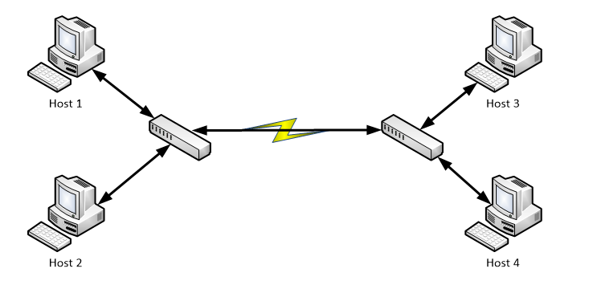

# History and evolution of the internet and the Web

## 1950s

_Networks_ did not really exist. Computers existed out of large mainframes with many terminals. Connections where in permanent use by a terminal. Connections could not be shared. This principle is called point-to-point communication.


## 1960-1970s

Some networks existed but where local implementations.

* ARPANET
* NPL
* Merit Network
* CYCLADES

Computers where very expensive at the time. It would be desirable to be able to use a computer that was on a remote location or on the other side of the country. The idea arose to connect these computers and mainframes to a large network. The cold war also emerged the idea that a computer network could survive a nuclear war. Permanent point-to-point connections where impossible or to expensive. A new technique needed to be used to make the networks possible.

A technique called **packet switching** was used to connect multiple networks over a single cable. Some protocols where invented that made use of packet switching to join the networks together.



In a packet switched network, all data is split into small packets. Each packet must be routed from destination to source. The time when no data is send, the line is available for use of other packets from other sources and destinations. In this way there is no more need of expensive and inefficient point-to-point connections.

## 1982: TCP/IP

TCP/IP is a set of protocols that make use of the packet switching principle. Although both protocols can be used separately. In almost any use case they come hand in hand.

### TCP: Transmission Control Protocol

The TCP protocol enables for a reliable connection between to endpoints. It uses handshaking to confirm that data has reached the destination. If something would happen that prevents the data from reaching the destination, the protocol will be able to detect this.

TCP also introduces the principle of `ports`. Each computer can use up to 65536 to listen to. Each port could be a different application or service that is made available to the other systems in the network. For example HTTP uses port 80 and email uses port 25. Using this principle a single computer can have both an HTTP server and SMTP \(mail\) server up and running.

### IP: Internet Protocol

The Internet Protocol enables reliable routing over a network. The IP protocol introduces the concept of an `IP address`. Each node on the network should have an IP address to allow communication between them. The IP protocol will ensure the right information reaches the right destination.

```text
192.168.1.1:80
```

The above combination of an IP address and a TCP port enables you to reach the computer on the network that has the IP address `192.168.1.1` and when it reaches the correct computer on the network it will pass the data to the TCP port `80` which is in normal cases an HTTP server.

* IP address: `192.168.1.1`
* TCP Port: `80`

## 1989: World Wide Web - www

Before 1989 networks where limited to military, universities and research. In 1989 it was decided to allow commercial activities on the `internet`. Now that all companies where allowed to make use of the internet, there was an increse of investments and thus an increase in bandwidth. This resulted in an explosive growth of users.

Until that time there was no uniform or standardized protocol to use the internet. Many protocol existed each with there own purpose and goal.

At CERN, Tim Berners-Lee tackled the problem of accessing information. He created technologies for sharing information. These technologies are still in use of today.

* HyperText Markup Language - HTML
* HyperText Transfer Protocol - HTTP
* Uniform Resource Locator - URL


You can still find the very first webpage that was created at that time at [http://info.cern.ch/](http://info.cern.ch/).

#### HyperText Markup Language - HTML

HyperText Markup Language - HTML was a way to add context and meaning to otherwise meaningless pieces of text. Some text may function as a title, other text is a paragraph in a set of other paragraphs and so on.

### HyperText Transfer Protocol - HTTP

Now that we have a way to markup documents we still need to share them and access them. The HyperText Transfer Protocol - HTTP is a protocol that enables the exchange of HTML documents over a computer network. It is a set of agreements on how to access a document.

#### Uniform Resource Locator - URL

HTTP provides a mean to exchange documents, be there is still need of a system that allow us to point to that document. An URL solves this problem by defining a unique string of names separated by slash `/` characters to identify documents on other nodes on a network.

Example of an URL:

```text
http://www.vives.be/info/eo-ict.html
```

* `http://` defines the protocol to use when accessing the computer on the network
* `www.vives.be` will directly be translated by DNS to an IP address an thus points to a computer/server on the network
* `/info/eo-ict.html` is the path of the document that we want to request on the computer/server.

## 1993: Mosaic Browser

Until 1993 all 'browsing' on the internet was still done in a pure textual form. No graphical browsers existed at that time.

In 1993 the Mosaic browser was released to the public. It was the first user-friendly graphical browser. It was later renamed to Netscape.

The graphical way of browsing the internet led to an other explosive growth in internet economy. Surfing the internet was never more easy.


## 1997-2000: Dot-com bubble

The massive growth of the internet resulted in every company wanting to profit from the new technology. Suddenly everybody was able to access the internet, en thus every company wanted to be available through the internet.

To many financial investments and expectations resulted in an overgrowth, and many companies went in way to deep. This resulted in a collapse and decrease of thrust in the internet. This period is often remembered as the _dot com bubble_


## 2004: Web 2.0

By 2004 the internet was changing from an information retrieval platform to a more interactive environment. At the time browsing the internet was an activity of mainly viewing and downloading information.

A trend that was set by Google was that users of the internet could upload or post information back to the internet. This resulted in interactive websites. These websites where often called web 2.0, although there was never a new version of the internet released. The internet is a set of technologies and techniques.

Some examples of web 2.0 websites:

* social networking
* blogs
* wiki's
* video sharing
* web applications 


## Internet of Things

The next \(r\)evolution in the internet is called the Internet of Things or IoT. The IoT tries to connect the world to the internet. Everyday devices and things will have access to data on the internet. This will enable to make these things smarter by exchanging information with each other.

All these smart devices generate a massive amount of data. A new challenge that has raised is the management of this data and extracting valuable information. This is called big-data.

