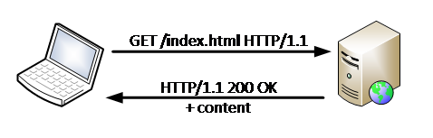
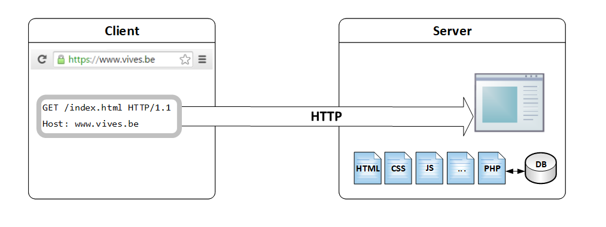

# Web protocols

## HTTP Protocol

* Protocol for Client-Server applications
* Protocol = system of rules that allow two or more entities of a communications system to transmit information
* How to request and respond is standardized in the HTTP protocol coordinated by the IETF - Internet Engineering Task Force
* HTTP stands for HyperText Transfer Protocol



* Client requests and server reponses
* Plain text protocol, thus readable for humans
* Default port is 80
* Stateless protocol
  * No state \(information or status\) is retained between requests
  * State can be retained with ‘HTTP cookies’ or ‘sessions’

### Client request

* The request message consists of the following:
  * A request line

      \*for example GET /images/logo.png HTTP/1.1, which requests a resource called /images/logo.png from the server

  * One or more Request header fields
    * such as Accept-Language: en, …
  * An empty line
  * An optional message body

Note: the host header is mandatory, all others are optional

```http
GET / HTTP/1.1
Accept: */*
Accept-Encoding: gzip, deflate
Connection: keep-alive
Host: www.vives.be
User-Agent: HTTPie/0.9.2
```

### Server response

* The response message consists of the following:
  * A Status-Line
    * which include the status code and reason message
    * e.g., HTTP/1.1 200 OK, which indicates that the client's request succeeded
  * Response header fields
    * such as Content-Type: text/html, …
  * An empty line
  * An optional message body

```http
HTTP/1.1 200 OK
CF-RAY: 225c457079770300-LHR
Cache-Control: public, max-age=180
Connection: keep-alive
Content-Encoding: gzip
Content-Language: nl
Content-Type: text/html; charset=utf-8
Date: Mon, 14 Sep 2015 12:59:49 GMT
Etag: W/"1442235275-1"
Expires: Sun, 19 Nov 1978 05:00:00 GMT
Last-Modified: Mon, 14 Sep 2015 12:54:35 GMT
Server: cloudflare-nginx
Set-Cookie: __cfduid=d9cb1e5a7a171cd3e48723d5f9d669c721442235589; expires=Tue, 13-Sep-16 12:59:49 GMT; path=/; domain=.vives.be; HttpOnly
Transfer-Encoding: chunked
Vary: Cookie,Accept-Encoding
X-Drupal-Cache: HIT
X-Generator: Drupal 7 (http://drupal.org)
X-Powered-By: PHP/5.5.16

<html>….</html>
```

### Try it yourself

1. Open chrome browser, and press F12 for the developer tools
2. Choose the ‘Network’ tab in the developer tools
3. Visit a website, eg: [www.vives.be](https://github.com/sillevl/course-webtechnology/tree/d04b8a1294c587f801b814d02c5ae938c1354659/introduction/www.vives.be)
4. Click on the initial request to view the details


## Getting documents over HTTP with clients and servers

1. The user types the URL in the browser \(client\)
2. The Browser translates the URL to a HTTP request
3. The browser sends the HTTP request to the server
4. The server generates a HTTP response containing the requested file
   1. Find the requested file
   2. Generate a HTTP response
   3. Add the requested file to the HTTP response
5. The server sends the HTTP response back to the client
6. The client processes the response and generates an output for the user

The user types the URL in the browser \(client\)


The Browser translates the URL to a HTTP request


The browser sends the HTTP request to the server



The server generates a HTTP response containing the requested file


The server sends the HTTP response back to the client


The client processes the response and generates an output for the user


<YoutubeVideo video-id="keo0dglCj7I" />

## DNS - Domain Name System

> Domain Name System \(DNS\) is a hierarchical distributed naming system for computers, services, or any resource connected to the Internet Source: wikipedia

* Translates domain names, which can be easily memorized by humans, to the numerical IP addresses needed for the purpose of computer services and devices worldwide
* www.wikipedia.org --&gt; 91.198.174.192


