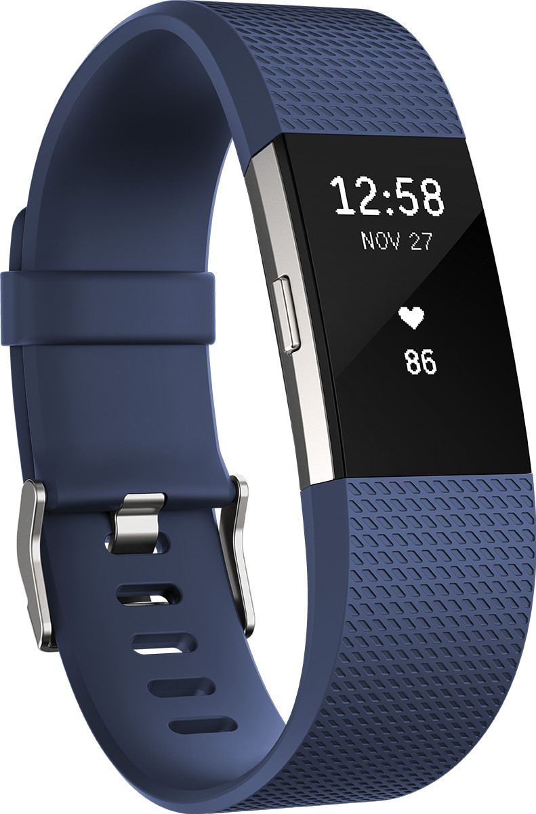

# IoT - Internet of Things

The Internet of Things \(IoT\) is the network of physical devices, vehicles, home appliances, and other items embedded with electronics, software, sensors, actuators, and connectivity which enables these things to connect and exchange data, creating opportunities for more direct integration of the physical world into computer-based systems, resulting in efficiency improvements, economic benefits, and reduced human exertions.

The number of IoT devices increased 31% year-over-year to 8.4 billion in the year 2017 and it is estimated that there will be 30 billion devices by 2020. The global market value of IoT is projected to reach $7.1 trillion by 2020.

IoT involves extending _Internet connectivity beyond standard devices_, such as desktops, laptops, smartphones and tablets, to any range of traditionally dumb or non-internet-enabled physical devices and everyday objects. Embedded with technology, these devices can communicate and interact over the Internet, and they can be remotely monitored and controlled.

## IoT enables

Many technologies enable the IoT conept. This is a mix of existing technologies and newly rising technologies specific for IoT. Some examples are:

* Wireless technologies
  * 3G, 4G, 5G
  * Wifi
  * Bluetooth
  * LoRaWAN, Sigfox, NB-IoT
  * Zigbee, Z-Wave
* Communication protocols
  * MQTT
  * CoAP

**Overview of IoT enabling wireless technologies**:

## Examples

### Nest thermostat

### Smoke detector

### Philips Hue smart lights

### LoRaWAN GPS trackers

### Smart watch

