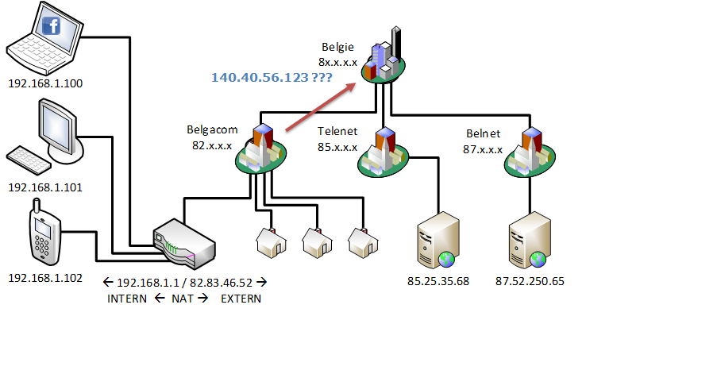
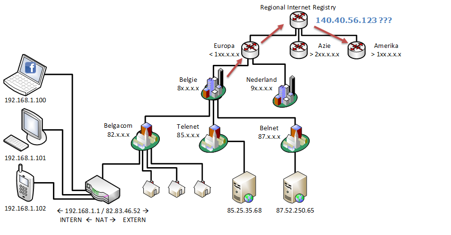
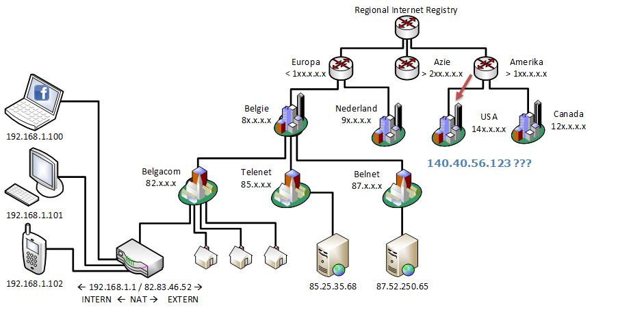
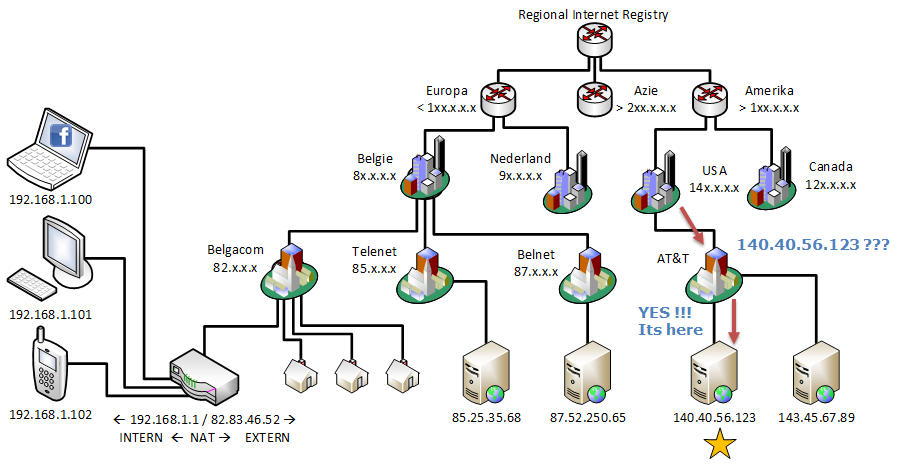
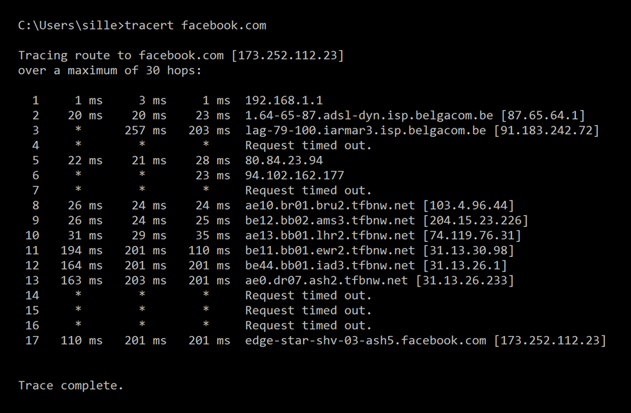

# TCP/IP stack

When using the web, a couple of protocols are used to get everything working smoothly. Let's take a look at some of them.

## IP - Internet Protocol

The IP protocol is the principle protocol for the internet. It **relays** datagrams across network boundaries. Routing functionality enables _internetworking_, this is what establishes the internet.

The IP protocol enables delivery of packets form _source_ to _destination_. It also defines packet structure that encapsulates the data.

The Internet Protocol Version 4 - IPv4 - is the dominant protocol of the internet. The 32bit addressing is reaching its limits, so a successor IPv6 - Internet Protocol Version 6 - is already standardized and in use. The migration from IPv4 to IPv6 will take many years to complete.

### IPv4

IPv4 uses 32-bit \(four-byte\) addresses and is limited to 4294967296 \(2^32\) addresses. It uses a **quad-dotted** representation

### IPv6

IPv6 is dealing with the long anticipated problem of the limited range of IPv4 addresses. It uses an 128-bit address. Instead of an decimal notation, it uses an hexadecimal notation.

::: tip Fun fact
2^128 = 3.40 x 10^38 different ip addresses are possible with IPv6. On earth there are around 10^20 till 10^24 grains of sand. In the observable universe, there are around 10^24 stars. This means that every grain of sand or every star in the universe can have 100 trillion ip addresses...
:::

<YoutubeVideo video-id="iGPXkxeOfdk" />

### IP Routing

You want to visit facebook.com. The facebook.com server has the IP address `140.40.56.123` \(got this address from the DNS server\)

* **Source**: `192.168.1.100`
* **Destination**: `140.40.56.123`

Where can I find this server with IP: `140.40.56.123`??? Let’s ask the home router \(`192.168.1.1`\)

Nope, I don’t know where to find the IP `140.40.56.123`

I will ask Belgacom…

Note!!! NAT: Network Address Translation is used here to switch from a local network to the internet \(source is changed to `82.83.46.52` instead of `192.168.1.100`\) and visa versa when receiving the answer.

Belgacom do you know where to find `140.40.56.123`?

Nope, I only know where to find IP’s ranging from `82.0.0.0` to `82.255.255.255`

I will ask it to the local regstery \(for Belgium\)

Belgian registry does not know either so forwards the request to the European registry.

European registry does not know either and forwards the request to the Regional Internet Registry.

The Regional Internet Registry does not know either, but does now somebody that might know it and forwards the packet to the American Registry that is responsible for all IP addresses that are between `100.0.0.0` and `199.255.255.255`

The American Registry does not know either, but does now somebody that might know it and forwards the packet to the USA Registry that is responsible for all IP addresses that are between `140.0.0.0` and `149.255.255.255`.

The USA Registry does not know either, but does now somebody that might know it and forwards the packet to the AT&T.

AT&T knows where the server with IP `14.40.56.123` is and forwards the packet to the server.

With the `tracert` command you can test and take a look at the different routers that are between you and the server you want to connect to.

<YoutubeVideo video-id="L6bDA5FK6gs" />

## TCP - Transmission Control Protocol

> The Transmission Control Protocol \(TCP\) provides reliable, ordered, and error-checked delivery of data between applications running on hosts communicating over an IP network Source: wikipedia

* TCP is almost always used with the IP – protocol
  * Is commonly referred to as TCP/IP
  * Combination of an IP address with an TCP port

      \*Eg: 192.168.1.1:80
* Applications that do not need reliable delivery of data can use UDP instead \(User Datagram Protocol\)
* Introduces the concepts of ‘ports’
  * Each side of a TCP connection has an associated 16-bit port number \(0-65535\) 
  * Provide several clients with several services simultaneously

Ports:

* 20: FTP data transfer
* 21: FTP control \(command\)
* 22: Secure Shell \(SSH\)—used for secure logins, file transfers         \(scp, sftp\) and port forwarding
* 23: Telnet
* 25: SMTP, used for email
* 80: HTTP
* 443: Hypertext Transfer Protocol over TLS/SSL \(HTTPS\)
* …

More ports: [https://en.wikipedia.org/wiki/List\_of\_TCP\_and\_UDP\_port\_numbers ](https://en.wikipedia.org/wiki/List_of_TCP_and_UDP_port_numbers%20)
