# CSS Box model

## Introduction

* We already described that CSS threats each HTML element as if it lives in its own box
* You can set several properties that affect the appearance of these boxes
  * Controlling the dimensions of your boxes
  * Create borders around boxes
  * Set margins and padding for boxes
  * Show and hide boxes
* In the one of the next chapters we will se how to position these boxes on your pages, when we look at page layout

## Box dimensions: `width`, `height`

* By default the box size is just big enough to holds it content
* You can set your own dimensions by using the height and width properties
* Traditionally for specifying box sizes, pixels have been the most popular method as they allow  accurate control
* When using percentages, the size of the box is relative to the size of the containing box
  * Or relative to the browser window if it has no containing box
* When using ems, the size of the box is based on the size of the text within
  * This allows to create flexible designs across devices witch have different-sized screens

```html
<div>
  <p>The Moog company pioneered the commercial
    manufacture of modular voltage-controlled
    analog synthesizer systems in the early
    1950s.</p>
</div>
```

```css
div{
  height: 300px;
  width: 400px;
  background-color: #ee3080;
}
p {
  height: 75%;
  width: 75%;
  background-color: #e1ddda;
}
```

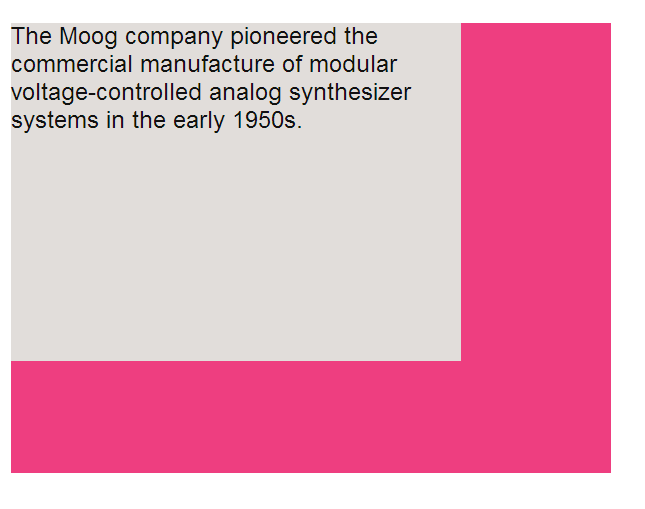

## Limiting widht: `min-width`, `max-width`

* Some page designs expand and shrink to fit the size of the user’s screen
* With the `min-width` property you can specify the smallest size a box can be displayed at
* With the `max-width` property you can specify the largest size a box can be displayed at
* These properties are very helpful to ensure that the content of pages are legible

```html
<tr>
  <td></td>
  <td class="description">The Rhodes piano is an
    electro-mechanical piano, invented by Harold
    Rhodes during the fifties and later
    manufactured in a number of models ...</td>
  <td>$1400</td>
</tr>
```

```css
td.description {
  min-width: 450px;
  max-width: 650px;
  text-align: left;
  padding: 5px;
  margin: 0px;
}
```

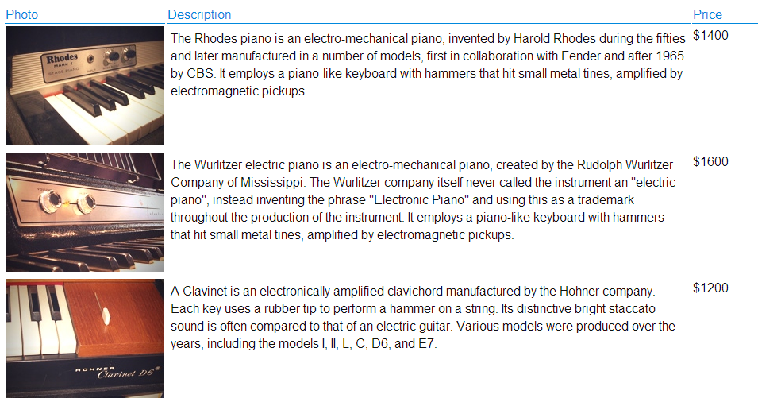

## Limiting height: `min-height`, `max-height`

The same way that you might want to limit width of a box on a page, you might also want to limit the height of it
You can achieve this using the `min-height` and `max-height` property

```html
<h2>Fender Mustang</h2>
<p>The Fender Mustang was introduced in 1964 as the
   basis of a major redesign of Fender's ...</p>
<h2>Fender Stratocaster</h2>
<p>The Fender Stratocaster or "Strat" is one of the
   most popular electric guitars of all time ...</p>
<h2>Gibson Les Paul</h2>
<p>The Gibson Les Paul is a solid body electric
   guitar that was first sold in 1952 ...</p>
```

```css
h2, p {
   width: 400px;
   font-size: 90%;
   line-height: 1.2em;
}
h2 {
   color: #0088dd;
   border-bottom: 1px solid #0088dd;
}
p {
   min-height: 10px;
   max-height: 30px;
}
```

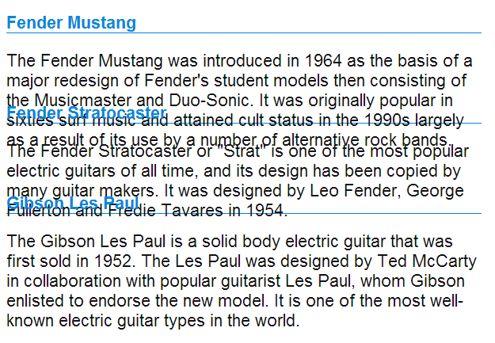

## Overflowing content: `overflow`

The overflow property tells the browser what to do if the content contained within a box is larger than the box itself
hidden
This simply hides any extra content that does not fit in the box
scroll
This property adds a scrollbar to the box so that users can scroll to see the missing content

```html
<h2>Fender Stratocaster</h2>
<p class="one">The Fender Stratocaster or "Strat"
   is one of the most popular electric guitars of
   all time, and its design has been copied by many
   guitar makers. It was designed by Leo... </p>
<h2>Gibson Les Paul</h2>
<p class="two">The Gibson Les Paul is a solid body
   electric guitar that was first sold in 1952.
   The Les Paul was designed by Ted McCarty... </p>
```

```css
p.one {
   overflow: hidden;
}
p.two {
   overflow: scroll;
}
```

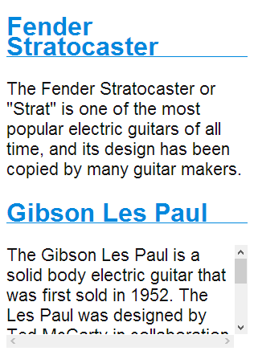

## Borders, margins and paddings

Every box has three available properties that can be adjusted to control its appearance = the **box model**

* **BORDER**: Every box has a borders (even if it is not visible or specified to be 0 pixels wide). The borders separates the edge of one box from another
* **MARGIN**: Margins sit outside the edge of the border. You can set the width of a margin to dreate a gap between the borders of two adjacent boxes
* **PADDING**: Padding is the space between the border of a box and any content contained within it. Adding padding can increase the readability of its content

If you specify a width for a box, Then the borders, margins and paddings are added to its width and height

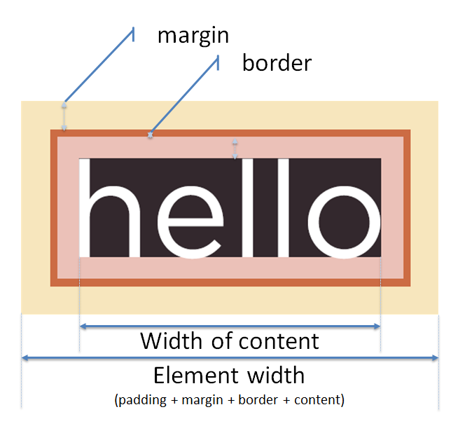

## White space & vertical margin

* The `padding` and `margin` properties are very helpful in adding space between various items on the page
* Designers refer to the space between items on a page as **white space**
* Imagine you had a border around a box, you would not want the text to touch this border or you would not want the boxes to touch edges

Without margin and padding

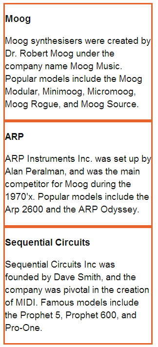

With margin and padding

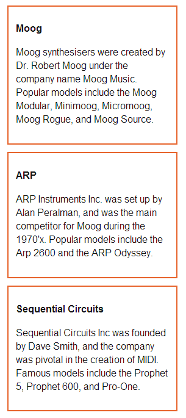

## Border width: `border-width`

* The `border-width` property is used to control the width of a border. The value can be given in `pixels` or using one of the following values:

  * `thin`
  * `medium`
  * `thick`
  
* You can control individual size of borders using four separate properties:
  
  * `border-top-width`
  * `border-right-width`
  * `border-bottom-with`
  * `border-left-width`

* You can also specify different widths for the four values in one property:
  
  * `border-width: 2px 1px 1px 2px;`
  * Values appear in clockwise order: top, right, bottom, left

```html
<p class="one">Hohner's "Clavinet" is essentially an
   electric clavichord.</p>
<p class="two">Hohner's "Clavinet" is essentially an
   electric clavichord.</p>
<p class="three">Hohner's "Clavinet" is essentially
   an electric clavichord.</p>
```

```css
p.one {
   border-width: 2px;
}
p.two {
   border-width: thick;
}
p.three {
   border-width: 1px 4px 12px 4px;
}
```

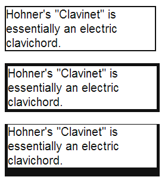

## Border style: `border-style`

* You can control the style of a border using the border-style property. This property can take the following values:

  * `solid` a single solid line
  * `dotted` a series of square dots (size of dot and gap are equal)
  * `dashed` as series of short lines
  * `double` two solid lines
  * `groove` appears to be carved into the page
  * `ridge` appears to stick out from the page
  * `inset` appears embedded into the page
  * `outset` looks like it is coming out of the screen
  * `hidden`/`none` no border is shown

* You can individually change the styles of different borders using:

  * `border-top-style`
  * `border-left-style`
  * `border-right-style`
  * `border-bottom-style`

```html
<p class="one">Wurlitzer Electric Piano</p>
<p class="two">Wurlitzer Electric Piano</p>
<p class="three">Wurlitzer Electric Piano</p>
<p class="four">Wurlitzer Electric Piano</p>
<p class="five">Wurlitzer Electric Piano</p>
<p class="six">Wurlitzer Electric Piano</p>
<p class="seven">Wurlitzer Electric Piano</p>
<p class="eight">Wurlitzer Electric Piano</p>
```

```css
p.one {border-style: solid;}
p.two {border-style: dotted;}
p.three {border-style: dashed;}
p.four {border-style: double;}
p.five {border-style: groove;}
p.six {border-style: ridge;}
p.seven {border-style: inset;}
p.eight {border-style: outset;}
```

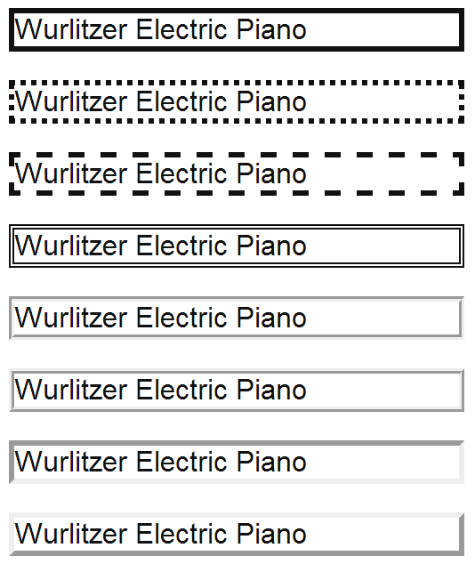

## Border color: `border-color`

* You can specify the color of a border with the `border-color` property either using RGB values, hex codes or CSS color names
* You can individually control the colors of the borders on the different sides of a box using
  
  * `border-top-color`
  * `border-right-color`
  * `border-bottom-color`
  * `border-left-color`

* You can control all four border colors in one property

```html
<p class="one">The ARP Odyssey
   was introduced in 1972.</p>
<p class="two">The ARP Odyssey
   was introduced in 1972.</p>
```

```css
p.one {
   border-color: #0088dd;
}
p.two {
   border-color: #bbbbaa #111111 #ee3e80 #0088dd;
}
```

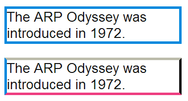

## Border shorthand: `border`

* The border property allow you to specify the width, style and color of a border in one property
  * The values should be coded in that specific order

```html
<p>Here is a simple chord sequence played on a
   Hammond organ through a Leslie speaker.</p>
```

```css
p {
   width: 250px;
   border: 3px dotted #0088dd;
}
```

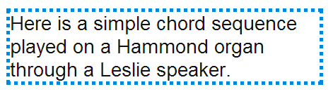

## Padding: `padding`

* The `padding` property allows you to specify how much space should appear between the content of an element and its border
* The value of this property is often specified in pixels
* You can specify different values for each side of a box or use the shorthand
  * Sometimes you might see the following, which means that left an right padding should be 10 pixels and the top and bottom paddings should be 20 pixels:
  * `padding: 10px 20px;`
* Note that if a width is specified for a box, padding is added    into the width of the box
* The value of padding is not inherited by child elements

```html
<p>Analog synths produce a wave sound, whereas the
   sounds stored on a digital synth have been
   sampled and then turned into numbers.</p>
<p class="example">Analog synths produce a wave
   sound, whereas the sounds stored on a digital
   synth have been sampled and then ... </p>
```

```css
p {
   width: 275px;
   border: 2px solid #0088dd;
}
p.example {
   padding: 10px;
}
```

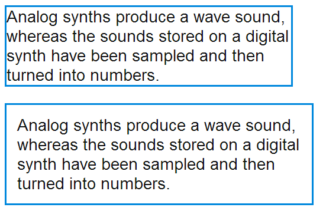

## Margin: `margin`

* The `margin` property controls the gap between boxes
* It value is commonly given in pixels although percentages and ems are also possible
* If one box sits on top of another, margins are collapsed, witch means the larger of the two margins is used and the smaller will be disregarded
* You can specify different values for each side of a box or use the shorthand
* Note that if a width is specified for a box, margin is added to the width of the box
* The value of margin is not inherited by child elements

```html
<p>Analog synthesizers are often said to have a
   "warmer" sound than their digital
   counterparts.</p>
<p class="example">Analog synthesizers are
   often said to have a "warmer" sound than
   their digital counterparts.</p>
```

```css
p {
   width: 200px;
   border: 2px solid #0088dd;
   padding: 10px;
}
p.example {
   margin: 20px;
}
```

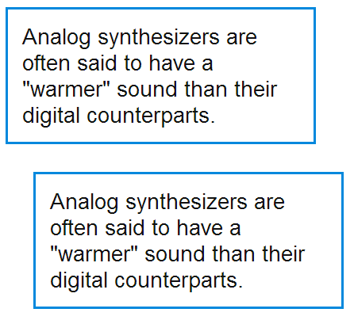

## Centering content

* If you want to center a box on the page or center it inside the element that it sits in, you can set the `left-margin` and `right-margin` to `auto`
  * This will make the browser put an equal gap on each side of the box
* In order to center a box on the page, you will need to set a width for the box, otherwise it will take up the full width of the page

```html
<body>
   <p>Analog synthesizers are often said to have a
      "warmer" sound than their digital counterparts.</p>
   <p class="example">Analog synthesizers are often
      said to have a "warmer" sound than their
      digital counterparts.</p>
</body>
```

```css
body {
   text-align: center;
}
p {
   width: 300px;
   padding: 50px;
   border: 20px solid #0088dd;
}
p.example {
   margin: 10px auto 10px auto;
   text-align: left;
}
```

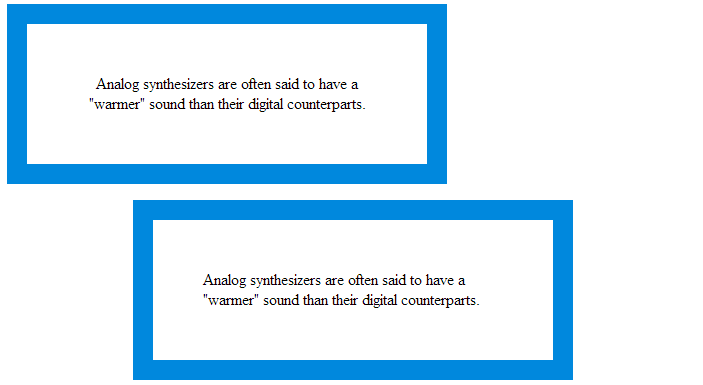

## Changing inline/block: `display`

* The display property allows you to turn an inline element into a block-level element or vice versa, and can also be used to hide an element from the page
* The display property can take following values:

* `inline`: This causes a block-level element to act like an inline element
* `block`: This causes an inline element to act like a block-level element
* `inline-block`: This causes a block-level element to flow like and inline element, while retaining other features of a block-level element
* `none`: This hides an element from the page, and acts as it not on the page at all (although a user can see it in the source)

```html
<ul>
   <li>Home</li>
   <li>Products</li>
   <li class="coming-soon">Services</li>
   <li>About</li>
   <li>Contact</li>
</ul>
```

```css
li {
   display: inline;
   margin-right: 10px;
}
li.coming-soon {
   display: none;
}
```

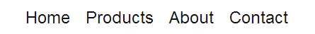

## Hiding boxes: `visibility`

* The visibility property allows you to hide boxes from users but leave a space where the element would have been
  * If you do not want an blank space to appear, you should use the display property

This property can take two values:

* `hidden`: This hides the element
* `visible`: This shows the element

```css
li {
   display: inline;
   margin-right: 10px;
}
li.coming-soon {
   visibility: hidden;
}
```


## Round corners: `border-radius`

* CSS3 introduces the ability to create rounded corners on any box, using a property called `border-radius`. The value indicates the size of the radius in pixels
* Older browsers that do not support this property will show right-angled corners
* The `-moz-border-radius` and `-webkit-border-radius` are not in the CSS specification. * However they are used by some versions of Chrome, Firefox and Safari to offer early support for this style
* You can specify individual values for each corner of a box or use the shorthand notation

```html
<p>Pet Sounds featured a number of unconventional
   instruments such as bicycle bells, buzzing
   organs, harpsichords, flutes, Electro-Theremin,
   dog whistles, trains, Hawaiian-sounding string
   instruments, Coca-Cola cans and barking dogs.</p>
```

```css
p {
   border: 5px solid #cccccc;
   padding: 20px;
   width: 275px;
   text-align: center;
   border-radius: 10px;
   -moz-border-radius: 10px;
   -webkit-border-radius: 10px;
}
```

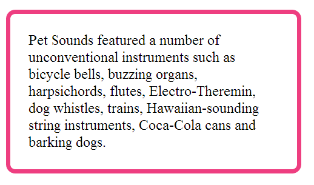

## Summary

* CSS treats each HTML element as if it has its own box
* You can use CSS to control the dimensions of a box
* You can also control the borders, margins and padding for each box with CSS
* It is possible to hide elements using the display and visibility properties
* Block-level boxes can be made into inline boxes and inline boxes made into block-level boxes
* Legibility can be improved by controlling the width of boxes containing text and the leading
* CSS3 has introduced the ability to create round corners
