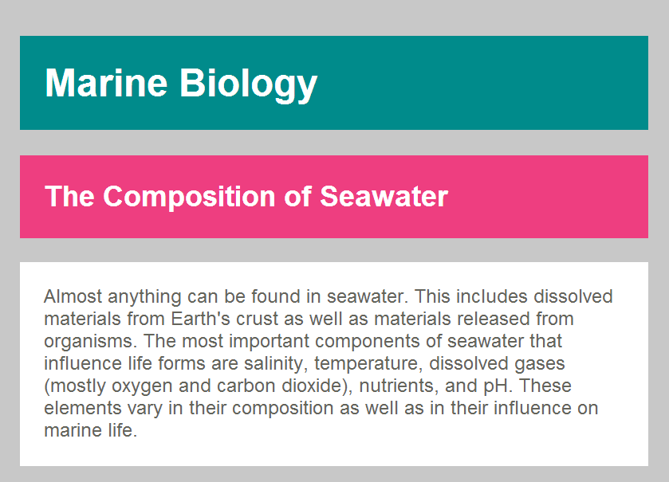
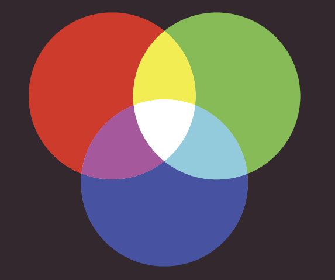
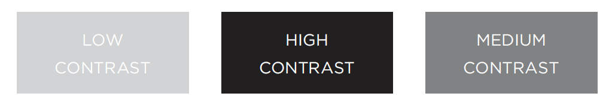
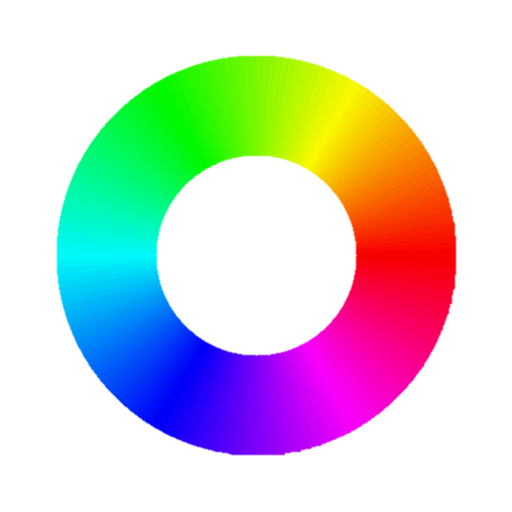
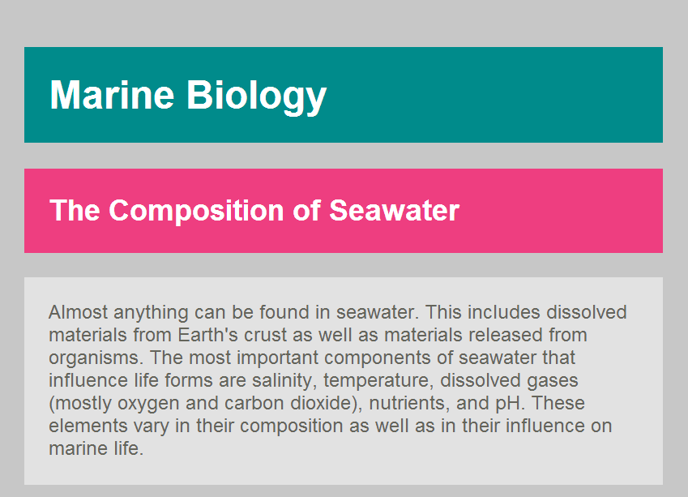
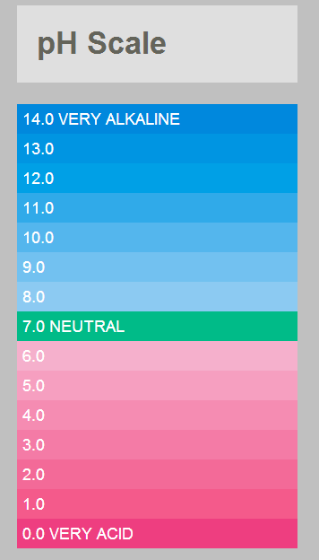

# Color

## Introduction

* How to specify color, as there are three common ways in which you can indicate your choice of colors
  * CSS3 offers some extra ways to specify colors
* Color terminology, as there are some terms that are very helpful to understand when it comes to picking colors
* Contrast, and ensuring that your text is readable
* Background colors for behind either your entire page or parts of a page

In CSS, colors can be specified in three ways:

* **RGB values**: Express colors in terms of how much red, green and blue are used to make it up ( 0 = 0%, 255 = 100%) `rgb(100,100,90)`
* **HEX codes**: Six-digit codes that represent the amount of red, green and blue in a color, preceded by a pound or hash # sign ( 00 = 0%, FF = 100%) `#ee3e80`
* **Color names**: There are 147 predefined color names that CSS can recognize `DarkCyan`

## Foreground color: `color`

To change the color of text, you can use the `color` property.

```css
/* color name */
h1 {
    color: DarkCyan;
}
/* hex code */
h2 {
    color: #ee3e80;
}
/* rgb value */
p {
    color: rgb(100,100,90);
}
```


Anyting between the `/*` symbols and the `*/` symbols will not be interpreted by the browser

The use of comment can help you to understand the CSS file

## Background color: `background-color`

* CSS treats each HTML element as if it appears in a box, and the `background-color` property sets the color of the background for that box
* You can specify you choice the by using any of the three ways
* If you do not specify a background color, then the background is transparent
* By default, most browsers windows have a white background
  * users can set a background color for there windows in there browser, so if you want to be sure that the background is white, you can use the `background-color` property on the `<body>` element

```css
body {
    background-color: rgb(200,200,200);
}
h1 {
    background-color: DarkCyan;
}
h2 {
    background-color: #ee3e80;
}
p {
    background-color: white;
}
```



## Understanding color

* Every color on a computer screen is created by mixing amounts of red, green and blue.
* Computer monitors are made up of thousands of tiny squares called pixels
* When the screen is not turned on, it’s black because it’s not emitting any light. When it’s on, each pixel can be a different color, creating a picture
* The color of every pixel on the screen is expressed in terms of a mix of red, green and blue



### Specifying colors

#### RGB values

Values for red, green and blue are expressed as numbers between 0 and 255


```css
rgb(102,205,170)
```

This color is mad up of the following values:

* 102 red
* 205 green
* 170 blue

#### Hex codes

Hex values represent values for red, green and blue in hexadecimal code


```css
#66cdaa
```

The value of the red, 102, is expressed as `66` in hexadecimal. The 205 of green is expressed as `cd` and the 170 of blue equates to `aa`.

#### Color names

Colors are represented by predefined names. However they are very limited in number.


```css
MediumAquaMarine
```

There are 140 color names supported by browsers. Most consider this to be a limited color palette, and the names are hard to remember

List with all known colors by CSS: <https://www.w3schools.com/cssref/css_colors.asp>

### Color properties

#### Hue


Hue is near to the colloquial idea of color. Technically speaking however, a color can have saturation and brightness as wel as hue

#### Saturation


Saturation refers to the amount of gray in a color. At maximum saturation, there would be no gray in the color. At minimum saturation the color would be mostly gray

#### Brightness


Brightness (or "value") refers to how much black is in a color. At maximum brightness, there would be no black in the color. At minimum brightness, the color would be very dar;.

### Contrast

When picking foreground and background colors, it is important to ensure that there is enough contrast for the text to be legible.



* Low contrast: Text is harder to read when there is low contrast between background and foreground colors. This can be a problem for those with visual impairments and color blindness. It also affects those with poor monitors and sunlight on their screens
* High contrast: Text is easier to read when there is higher contrast between background and foreground colors. If you want people to read al lot of text on your page, then to much contrast makes it harder to read.
* Medium contrast: For long spans of text, reducing the contrast a little bit improves readability. You can reduce contrast by using dark gray text on a white background or an off-white text on a dark background

Choosing colors:

* <http://www.colorpicker.com/>
* <http://www.colourlovers.com/palettes>

## Opacity: `rgba`

* CSS3 introduces the opacity property which allows you to specify the opacity of an element and of its child elements
  * The value is a number between 0.0 and 1.0 (0% and 100%)
* The `rgba` property allows you to specify a color in RGB value, but adds a fourth value to indicate *opacity*. This value is known as an alpha value
* Older browsers do not recognize RGBA colors. To fall back you can specify normal `rgb` colors first and override them with `rgba` colors

```css
p.one {
    background-color: rgb(0,0,0);
    opacity: 0.5;
}
p.two {
    background-color: rgb(0,0,0);
    background-color: rgba(0,0,0,0.5);
}
```


## HSL Colors

CSS3 introduces an entirely new and intuitive way to specify colors using hue, saturation and lightness values.



* **HUE**: Is the colloquial idea of color. Hue is often represented as a circle where the angle represents the color. Values  go form 0 to 360.
* **SATURATION**: Is the amount of gray in a color. Saturation is represented as a percentage. 100% is full saturation and 0% is a shade of gray
* **LIGHTNESS**: Lightness is the amount of white (lightness) or black (darkness) in a clor. Lightness is represented as a percentage. 0% lightness is black, 50% lightness is normal. Lightness is sometimes referred to as luminosity

## HSL & HSLA: `hsl`, `hsla`

* The `hsl` property is introduced in CSS3 as an alternative way to specify color.
* The `hsla` property allows you to specify `hsl` colors with an additional transparency. The alpha value is expressed as a number between `0.0` and `1.0`
* Older browsers to not recognize HSL and HSLA colors. It is a good idea to provide a fallback  with an RGB color using hex code.

```css
body {
    background-color: #C8C8C8;
    background-color: hsl(0,0%,78%);
}
p {
    background-color: #ffffff;
    background-color: hsla(0,100%,100%,0.5);
}
```



## Example

This example shows a pH scale to demonstrate the different ways colors can be specified using CSS.

* Color names
* Hex codes
* RGB values
* HSL values



```html
<!DOCTYPE html>
<html>
    <head>
        <title>Color</title>
        <link rel="stylesheet" href="css/style.ss">
    </head>
    <body>
        <h1>pH Scale</h1>
        <p class="fourteen">14.0 VERY ALKALINE</p>
        <p class="thirteen">13.0</p>
        <p class="twelve">12.0</p>
        <p class="eleven">11.0</p>
        <p class="ten">10.0</p>
        <p class="nine">9.0</p>
        <p class="eight">8.0</p>
        <p class="seven">7.0 NEUTRAL</p>
        <p class="six">6.0</p>
        <p class="five">5.0</p>
        <p class="four">4.0</p>
        <p class="three">3.0</p>
        <p class="two">2.0</p>
        <p class="one">1.0</p>
        <p class="zero">0.0 VERY ACID</p>
    </body>
</html>
```

```css
body {
    background-color: silver;
    color: white;
    padding: 20px;
    font-family: Arial, Verdana, sans-serif;
}
h1 {
    background-color: #ffffff;
    background-color: hsla(0,100%,100%,0.5);
    color: #64645A;
    padding: inherit;
}
p {
    padding: 5px;
    margin: 0px;
}
p.zero {background-color: rgb(238,62,128);}
p.one {background-color: rgb(244,90,139);}
p.two {background-color: rgb(243,106,152);}
p.three {background-color: rgb(244,123,166);}
p.four {background-color: rgb(245,140,178);}
p.five {background-color: rgb(246,159,192);}
p.six {background-color: rgb(245,176,204);}
p.seven {background-color: rgb(0,187,136);}
p.eight {background-color: rgb(140,202,242);}
p.nine {background-color: rgb(114,193,240);}
p.ten {background-color: rgb(84,182,237);}
p.eleven {background-color: rgb(48,170,233);}
p.twelve {background-color: rgb(0,160,230);}
p.thirteen {background-color: rgb(0,149,226);}
p.fourteen {background-color: rgb(0,136,221);}
```

## Summary

* There are three ways to specify colors in CSS:
  * RGB values
  * Hex codes
  * Color names
* Color pickers can help you find the color you want
* It is important to ensure that there is enough contrast between any text and the background (otherwise people will not be able to read your content)
* CSS3 has introduced an extra value for RGB colors to indicated opacity, it is known as `RGBA`
* CSS3 also allows you to specify colors as HSL values with an optional opacity value, it is known as `HSLA`
