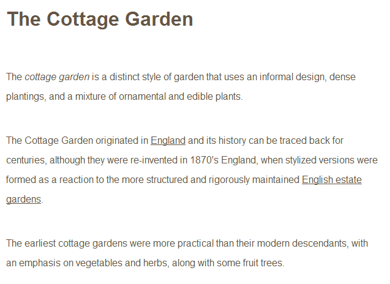
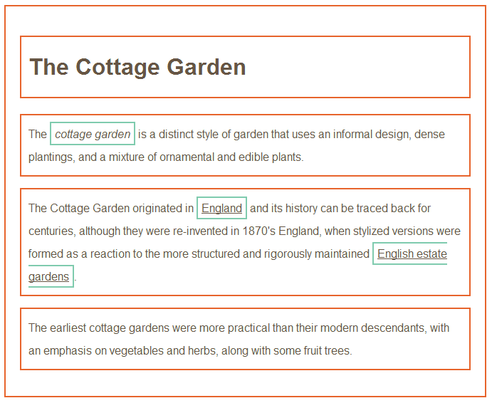
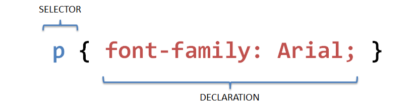
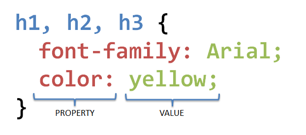
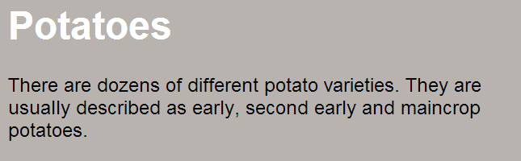
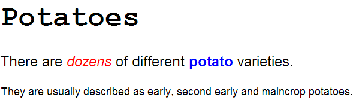
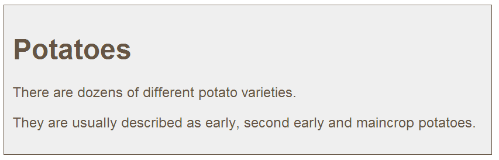

# Cascading Style Sheets - CSS

## CSS introduction

* CSS allows you to create rules that specify how the content of an element should appear.
  * E.g: you can specify that the background of a page is cream, all paragraphs should appear in gray using Arial typeface, or that all level one headings should be in a blue, italic Times typeface
* Once you know how CSS works it mostly involves learning the different properties you can use
* In this chapter we will see:
  * Introduction into how CSS works
  * Learn how to write CSS rules
  * How to apply CSS rules to your HTML pages

### Thinking inside the box

* The key to understand how CSS works is to imagine that there is an invisible box around every HTML element



* CSS allows you to create rules that  control the way that each individual box \(and the contents of that box\) is pretended



### Associate style rules with HTML elements



* CSS works by associating rules with HTML elements
* These rules govern how the content of specified elements should be displayed
* A CSS rules contains two parts: a **selector** and a **declaration**
* This rule indicates that all `<p>` element should be shown in the Arial typeface
* _Selectors_ indicate which element the rules applies to
  * The same rule can apply to more than one element if you separate the element names with commas
* _Declarations_ indicate how the element referred to in the selector should be styled.
  * Declarations are split in two parts \(a property and a value\) and are separated by a colon

### properties and values



* CSS declarations sit inside curly brackets and each is made up of two parts: a **property** and a **value**, separated by a _colon_ `;`
* You can specify several properties in one declaration, each separated by a semi-colon
* This rule indicates that all `<h1>`, `<h2>` and `<h3>` elements should be shown in the Arial typeface, in a yellow color
* _Properties_ indicate the aspects of the element you want to change. E.g: color, font, width, height an border
* _Values_ specify the settings you want to use for the chosen properties. E.g: if you specify a `color` property, then the value is the color you want the text in these elements to be

## Including CSS

There are multiple ways to add CSS code alongside the HTML code.

* **External**: using a separate file to define CSS
* **Internal**: place the CSS inside the HTML document using the `<style>` element
* **Inline**: place the CSS inside the HTML element using the `style` attribute

### External CSS

* The `<link>` element can be used in an HTML document to tell the browser where to find the CSS file used to style the page
  * It is an empty element and lives inside the `<head>` element
  * It should use three attributes
  * An HTML page can use more than one style sheet. You can use multiple `<link>` elements
* The href attribute specifies the path to the CSS file
  * The CSS file is often placed inside a folder called ‘css’
* The type attribute specifies the type of document being linked to. The value should be text/css
* The rel attribute specifies the relationship between the HTML page and the file linked to The value should be stylesheet

```html
<!DOCTYPE html>
<html>
    <head>
        <title>Using External CSS</title>
        <link href="css/styles.css" type="text/css" rel="stylesheet" />
    </head>
    <body>
        <h1>Potatoes</h1>
        <p>There are dozens of different potato varieties. They are usually                 described as early, second early and maincrop potatoes.</p>
    </body>
</html>
```

`css/styles.css` document:

```css
body {
    font-family: arial;
    background-color:     rgb(185,179,175);
}

h1 {
    color: rgb(255,255,255);
}
```



### Internal CSS

* You can also include CSS rules within an HTML document by placing them inside a `<style>` element
  * The `<style>` element usually sits inside the `<head>` element
  * The type attribute should be used to indicate the styles are specified in CSS. The value should be `text/css`
* When building a site with more than one page, you should use an _external CSS_ style sheet
  * This allows all pages to use the same style rules \(rather than repeating them in each page
  * Keeps the content separated from how the page looks
  * Means you can change the style across all pages by altering just one single file

```html
<!DOCTYPE html>
<html>
    <head>
        <title>Using Internal CSS</title>
        <style type="text/css">
            body {
                font-family: arial;
                background-color: rgb(185,179,175);}
            h1 {
                color: rgb(255,255,255);}
        </style>
    </head>
    <body>
        <h1>Potatoes</h1>
        <p>There are dozens of different potato varieties. They are usually             described as early, second early and maincrop potatoes.</p>
    </body>
</html>
```


### Inline CSS

* In HTML 4 and Transitional XHTML you could also use a style attribute on most of the elements that appear in the body of a page.
  * CSS rules are placed in the value of the style attribute
* You should avoid using the style attribute in any new sites but you may see it in older code

```html
<p style="color: red;">
    Lorem ipsum...
</p>
```

## CSS Selectors

There are many different types of CSS selectors that allow you to target rules to specific elements in an HTML document

* Universal selector
* Type selector
* Class selector
* Id selector
* Child selector
* Descendant selector
* Adjacent sibling selector
* General sibling selector

### Univeral selector

Applies to all elements in the document

```css
* { }
```

Targets all elements on the page

### Type selector

Matches element names

```css
h1, h2, h3 { }
```

Targets the `<h1>`, `<h2>` and `<h3>` elements

### Class selector

Matches an element whose class attribute has a value chat matches one specified after the period symbol

```css
.note { }
```

Targets any element whose class attribute has a value of note

```css
p.note { }
```

Targets only `<p>` elements whose class attribute has a value of note

### Id selector

Matches an element whose id attribute has a value that matches the one specified after the pound or hash symbol

```css
#introduction { }
```

Targets the element whose id attribute has a value of introduction

### Child selector

Matches an element that is a direct child of another

```css
li>a { }
```

Targets any `<a>` elements that are children of an `<li>` element, but not other `<a>` elements in the page

### Descendent selector

Matches an element that is a descendent of another specified element \(not just a direct child of that element\)

```css
p a { }
```

Targets any `<a>` elements that sit inside a `<p>` element, even if there are other elements nested between them

### Adjacent sibling selector

Matches an element that is the next sibling of another

```css
h1+p { }
```

Targets the first `<p>` element after any `<h1>` element \(but not other `<p>` elements\)

### General sibling selector

Matches an element that is a sibling of another, although it does not have to be the direct preceding element

```css
h1~p { }
```

If you had two `<p>` elements that are siblings of an `<h1>` element, this rule would apply to both

## CSS cascade rules

* If there are two rules or more that apply to the same element, it is important to understand which will take precedence
* **Cascading** \(like a waterfall\) references to the ability to inherit or override style properties from other rules
* Understanding how CSS rules cascade means you can _write simpler style sheets_
  * you can create generic rules that apply to most elements and then override the properties on individual elements that need to appear differently

### LAST RULE

If the two selectors are identical, the latter of the two will take precedence

### SPECIFICITY

If one selector is more specific than the others, the more specific rule will take precedence over more general rules

### IMPORTANT

You can add !important after any property value to indicate that it should be considered more important than other rules that apply to the same element

Example:

```html
<h1>Potatoes</h1>
<p id="intro">
    There are <i>dozens</i> of different
    <b>potato</b> varieties.
</p>
<p>
    They are usually described as early,
    second early and maincrop potatoes.
</p>
```

```css
* {
    font-family: Arial, Verdana, sans-serif;
}
h1 {
    font-family: "Courier New", monospace;
}
i {
    color: green;
}
i {
    color: red;
}
b {
    color: pink;
}
p b {
    color: blue !important;
}
p b {
    color: violet;
}
p#intro {
    font-size: 100%;
}
p {
    font-size: 75%;
}
```



## Inheritance

* If you specify the `font-family` or `color` properties on the `<body>` element, they will apply to most child elements
  * the value of the `font-family` property is **inherited** by child elements
  * This saves you from having to apply these properties to as many elements \(and result in simpler style sheets\)
* `background-color` or `border` properties; are not inherited by child elements.
  * If these were inherited by all child elements then the page could look quite messy
* You can force a lot of properties to inherit values from their parent elements by using _inherit_ for the value of the properties

Example:

```html
<div class="page">
    <h1>Potatoes</h1>
    <p>There are dozens of different potato varieties.</p>
    <p>They are usually described as early, second early and
        maincrop potatoes.</p>
</div>
```

```css
body {
    font-family: Arial, Verdana, sans-serif;
    color: #665544;
    padding: 10px;
}
.page {
    border: 1px solid #665544;
    background-color: #efefef;
    padding: inherit;
}
```



## Why use external style sheets

* When building a website there are several advantages to placing your CSS rules in a separate style sheet \(.css file\)
  * All of your pages can share the same style sheet by using the  element on each HTML page to link to the same CSS document
  * Once the user downloaded the CSS style sheet, the rest of the site will load faster
  * If you want to make a change, you only need to edit one CSS file and all pages will be updated
  * HTML code will be easier to read and edit because it does not have lots of CSS rules in the same document
  * It is considered a good practice to separate the content and markup with the rules that determine how it appears
* Sometimes you might consider placing CSS rules in the same page as your HTML code
  * If you are creating a single page website
  * If you have one page which requires a few extra rules that are not used by the rest of the site
  * Most examples in this course place CSS rules in the  of the document. This is only to simplify the examples.
* It is still a better practice to keep all CSS rules in a separate file!

## Different version of CSS & browser quirks

* CSS1 was released in 1996
* CSS2 was released in 1998
* CSS3 is still being developed, but major browsers already started to implement it. \(Just like HTML5\)
* CSS can be interpreted differently by different browsers and may result in unexpected rendering.
  * Check your results in multiple browsers ! \(IE, Chrome, Firefox, Safari,…\)
  * Online tools can also show how your site would look like in different browsers
    * Browsercam.com, Browserlab.adobe.com, browsershots.org,…

## Summary

* CSS treats each HTML element as if it appears inside its own **box** and uses rules to indicate how that element should look
* Rules are made up of `selectors` \(that specify the element the rule applies to\) and `declarations` \(that indicate what these elements should look like\)
* Different types of selectors allow you to target your rules at different elements
* Declarations are made up of two parts: the `properties` of the element that you want to change, and the `values` of those properties
* CSS rules `cascade` when more than one rule conflict
* CSS rules usually appear in a **separate document**
