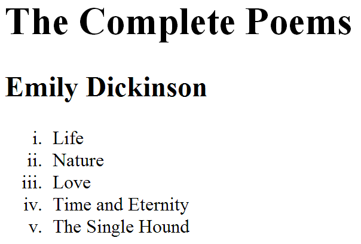
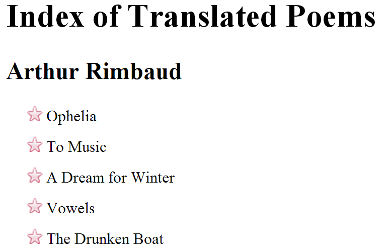
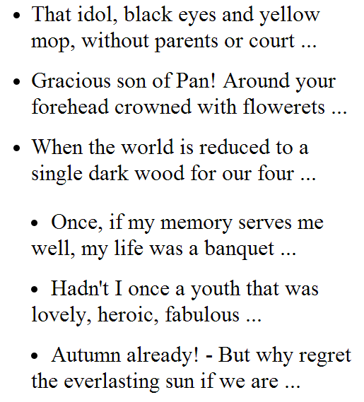
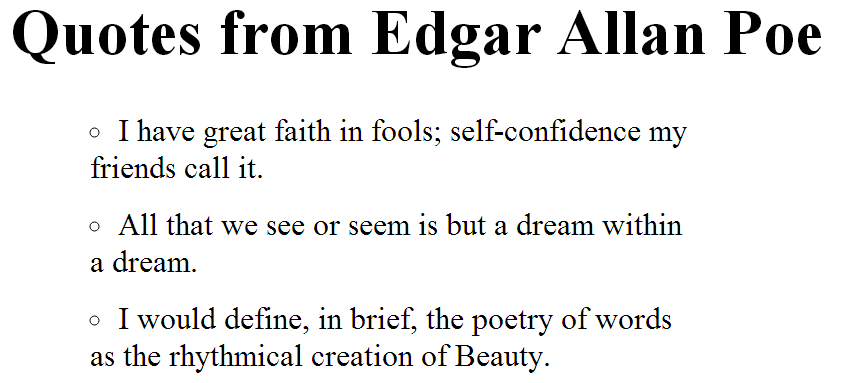

# CSS Lists

There are several CSS properties that were created to work with specific types of HTML elements, such as lists, tables and forms. Together these properties allow you to take finer control over specific parts of your pages.

## Bullet point styles `list-style-type`

The `list-style-type` property allow you to control the shape or style of a bullet point. It can be used on rules that apply to `<ol>`, `<ul>` and `<li>` elements.

### Unordered lists

| bullet style | `list-style-type` |
| ------------- | ------------- |
| | none |
| • | disc |
| ◦ | circle |
| ⁃ | square |

### Ordered lists (numbered)

| bullet style | `list-style-type` |
| ------------- | ------------- |
|  1  2  3 | decimal |
| 01 02 03 | decimal-leading-zero |
|  a  b  c | lower-alpha |
|  A  B  C | upper-alpha|
| i. ii. iii. | lower-roman |
| I II III | upper-roman |

```html
<h1>The Complete Poems</h1>
<h2>Emily Dickinson</h2>
<ol>
   <li>Life</li>
   <li>Nature</li>
   <li>Love</li>
   <li>Time and Eternity</li>
   <li>The Single Hound</li>
</ol>
```

```css
ol {
   list-style-type: lower-roman;
}
```



## Images for bullets `list-style-image`

You can specify an image to act as bullet point using the `list-style-image` property. The value is defined as an *url* giving the path to the image. This property can be used on rules that apply to the `<ul>` and `<li>` elements.

```html
<h1>Index of Translated Poems</h1>
<h2>Arthur Rimbaud</h2>
<ul>
<li>Ophelia</li>
<li>To Music</li>
<li>A Dream for Winter</li>
<li>Vowels</li>
<li>The Drunken Boat</li>
</ul>
```

```css
ul {
   list-style-image: url("images/star.png");
}
li {
   margin: 10px 0px 0px 0px;
}
```



## Positioning the marker `list-style-position`

Lists are intended into the page by default and the `list-style-position` property indicated whether the markers should appear on the `inside` or the `outside` of the box. This property can take one of two values:

* **outside**: The marker sits on the left of the block of text (this is the default )
* **inside**: The marker sits inside the box (which is intended)

```html
<ul class="illuminations">
  <li>That idol, black eyes and ...</li>
  <li>Gracious son of Pan! ...</li>
  <li>When the world is reduced ...</li>
</ul>
<ul class="season">
  <li>Once, if my memory serves ...</li>
  <li>Hadn't I once a youth ...</li>
  <li>Autumn already! ...</li>
</ul>
```

```css
ul {
  width: 150px;
}
li {
  margin: 10px;
}
ul.illuminations {
  list-style-position: outside;
}
ul.season {
  list-style-position: inside;
}
```



## List shorthand `list-style`

As with several other CSS properties, there is a property that acts as a shorthand for list styles. It is called `list-style`.

```html
<h1>Quotes from Edgar Allan Poe</h1>
<ul>
   <li> I have great faith in fools; self-confidence my friends call it.</li>
   <li>All that we see or seem is but a dream within a dream.</li>
   <li>I would define, in brief, the poetry of words as the rhythmical
       creation of Beauty.</li>
</ul>
```

```css
ul {
   list-style: inside circle;
   width: 300px;
}
li {
   margin: 10px 0px 0px 0px;
}
```


