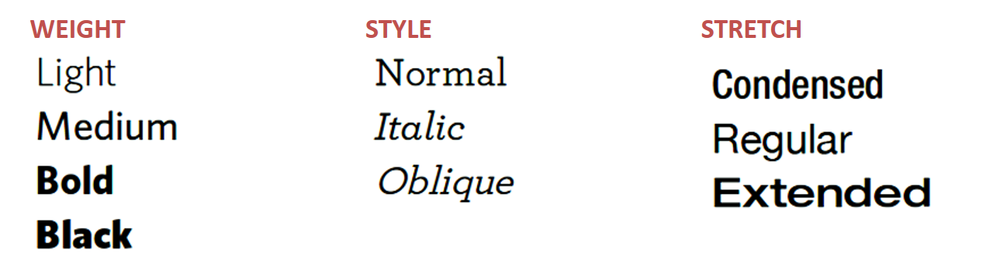
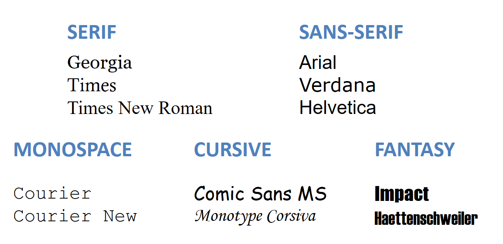
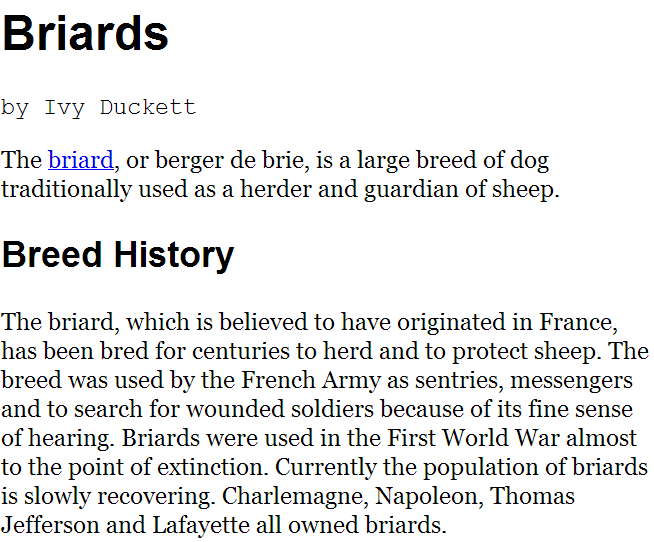
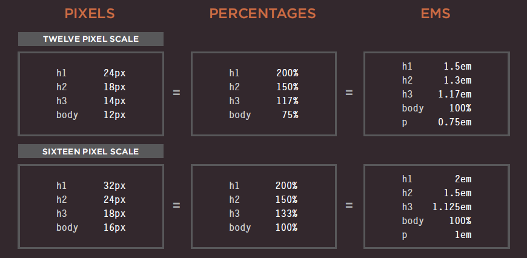
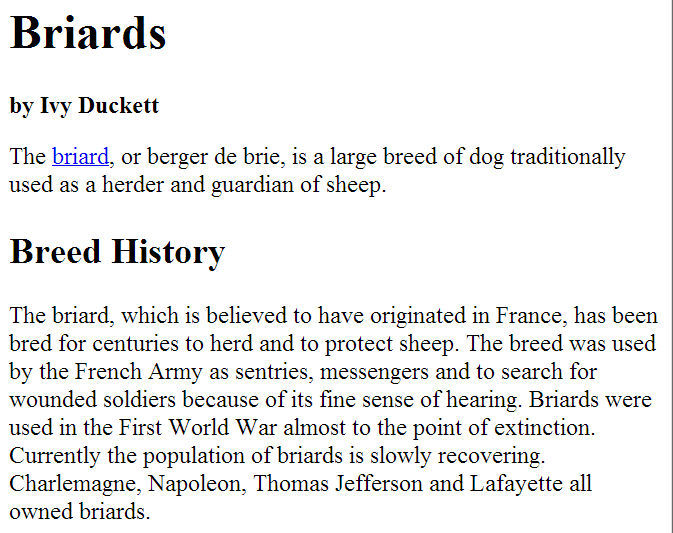
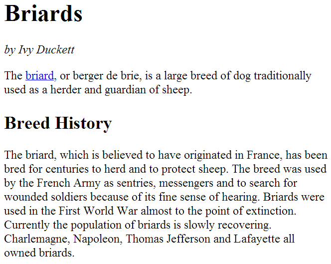
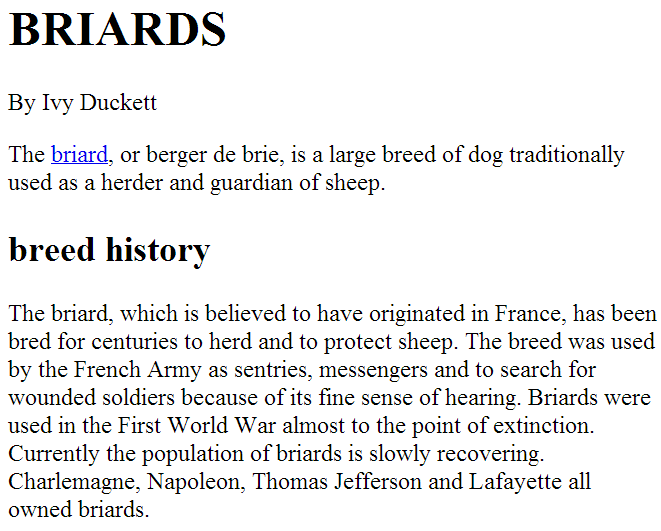
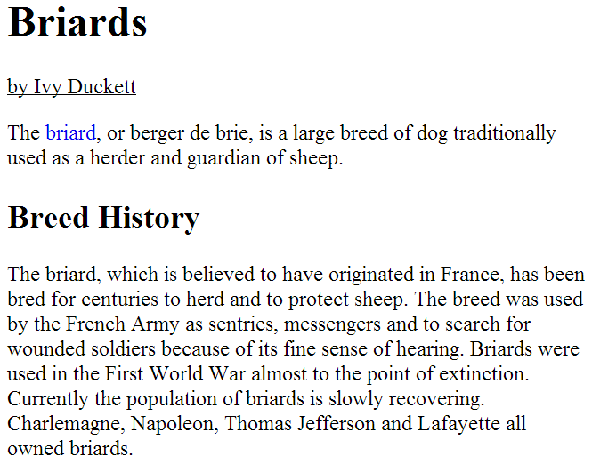
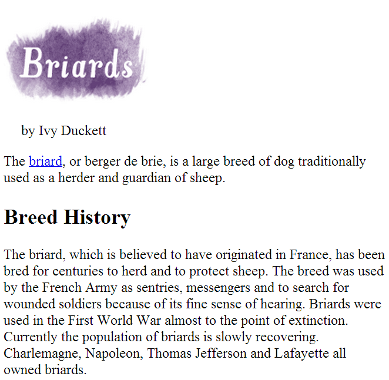

# Text

## Introduction

Properties that allow you to control the appearance of text can be split into two groups:

* Those that directly affect the font and its appearance
  * Typeface, regular, bold, italic, size,…

* Those that would have the same effect on text no matter what font you where using (color, spacing between words and letters,…)

The formatting of you text can have a significant effect on how readable your pages are
These properties will also control the design on how to display your type

## Typeface terminology

* **Serif**: Serif fonts have extra details on the ends of the main strokes of letters. These details are known as serifs. In *print*, serif fonts were traditionally used for long pages of text because they were considered easier to read.
* **Sans-Serif**: Sans-serif fonts have straight ends to letters, and therefore have a much cleaner design. *Screens* have much lower resolution than print. So, if the text is small, sans-serif fonts can be clearer to read.
* **Monospace**: Every letter in a monospaced (or fixed-width) font is the same width. Monospaced fonts are commonly used for *code* because they align nicely, making the text easier to follow.


Each typeface can come in many variants, changing different properties like:

* **Weight**: The font weight not only adds emphasis but can also affect the amount of white space and contrast on a page.
* **Style**: Italic fonts have a cursive aspect to some of the lettering. Oblique fonts styles take the normal style and put it on an angle.
* Stretch: In condensed (or narrow) versions of the font, letters are thinner and closer together. In expanded versions they are thicker and further apart.



### Choosing a typeface for your website

It is important to understand that a browser will only display fonts that are installed on that user’s computer !
As a result, sites often use a small set of typefaces that are installed on most computers (shown below). There are some techniques to get around this limitations.

* **Serif**: Serif fonts have extra details on the end of the main strokes of the letters.
* **Sans-Serif**: Sans-serif fonts have straight end to letters and therefore have a much cleaner design.
* **Monospace**: Every letter in a monospace typeface is the same width, non-monospaced fonts have different widths.
* **Cursive**: Cursive fonts either have joining strokes or other cursive characteristics, such as handwritten styles.
* **Fantasy**: Fantasy fonts are usually decorative fonts and are often used for titles. They are not designed for long bodies of text.



Browsers are supposed to support at least one typeface from each of the groups above. It is common to add the generic font name after your preferred choice of typefaces.

```css
font-family: Georgia, Times, serif;
```

## Specifying typefaces: `font-family`

The `font-family` property allow you to specify the typeface that should be used for any text inside the element(s) to which a CSS rule applies. The value of this property is the name of the typeface you want to use.

People who are visiting your site need the typeface you have specified installed on their computer in order for it to be displayed.

You can specify a list of fonts separated by commas so that, if the user does not have your first choice, the browser can try to use an alternative font from the list. If a font name is made up of more than one word, it should be put in double quotes.

```html
<!DOCTYPE html>
<html>
  <head>
    <title>Font Family</title>
</head>
  <body>
    <h1>Briards</h1>
    <p class="credits">by Ivy Duckett</p>
    <p class="intro">The <a class="breed"
       href="http://en.wikipedia.org/wiki/
       Briard">briard</a>, or berger de brie, is
       a large breed of dog traditionally used as
       a herder and guardian of sheep...
    </p>
  </body>
</html>

```

```css
body {
    font-family: Georgia, Times, serif;
}

h1, h2 {
    font-family: Arial, Verdana, sans-serif;
}

.credits {
    font-family: "Courier New", Courier, monospace;
}
```



### Size of type

The `font-size` property enables you to specify a size for the font. There are several ways to specify the size of a font.

* **pixels**: Pixels are commonly used because they allow web designers  very precise control over how much space their text takes up. The number of pixels is followed by the letters `px`.
* **percentages**: The default size of text in browsers is 16px. So a size of `75%` would be the equivalent of `12px`. `200%` would be `32px`.
* **ems**: An `em` is equivalent to the width of a letter `m`

Additional units exist and are explained on: <https://www.w3schools.com/cssref/css_units.asp>

## Size of type `font-size`

```css
body {
  font-family: Arial, Verdana, sans-serif;
  font-size: 12px;
}

h1 {
  font-size: 200%;
}

h2 {
  font-size: 1.3em;
}
```


### Type scales

Programs such as Word, Photoshop and InDesign offer the same sizes of text. They are set according to a scale or ratio that was developed by European typographers in the 16th century. When designing pages, using sizes from this scale will help them look more attractive. Print designers often refer to the size of text in terms of points rather than pixels
A pixel roughly equates to a point because a point corresponds to 1/72 of an inch, and most computer displays have a resolution of 72 dots per inch.

Best is to leave the body text at default of 16 pixels and adjust the other font sizes using a scale that keeps the relative proportions. 16 pixels might seem quite large but it is easier to read.



## Bold: `font-weight`

The `font-weight` property allows you to create bold text. There are two values that this property commonly takes:

* **normal**: this causes text to appear at a normal weight.
* **bold**: This causes text to appear bold.

```css
.credits {
   font-weight: bold;
}
```



## Italics: `font-style`

If you want to create italic tex, you can use the `font-style` property. There are three values this property can take:

* **normal**: This causes the text to appear in a  normal style.
* **italic**: This causes the text to appear italic.
* **oblique**: This causes the text to appear oblique

It is not unusual for the browser to fail to find an italic version of a typeface, in which case it will use an algorithm to place the normal version of the type on a slant, which means a lot of italic text online is actually oblique.

```css
.credits {
    font-style: italic;
}
```



## Uppercase & lowercase: `text-transform`

The `text-transform` property is used to change the case of text giving it one of the following values:

* **uppercase**: This causes the text to appear uppercase.
* **lowercase**: This causes the text to appear lowercase.
* **capitalize**: This causes the first letter of each word to appear capitalized.

```css
h1 {
   text-transform: uppercase;
}

h2 {
   text-transform: lowercase;
}

.credits {
   text-transform: capitalize;
}
```



## Underline & strike: `text-decoration`

The `text-decoration` property allows you to specify the following values:

* **none**: This removes any decoration already applied to the text
* **underline**: This adds a line underneath the text
* **overline**: This adds a line over the top of text
* **line-through**: This adds a line through words
* **blink**: This animates the text to make it flash on and off

```css
.credits {
   text-decoration: underline;
}

a {
   text-decoration: none;
}
```



## Indenting text: `text-indent`

The `text-indent` property allows you to indent the first line of text within an element. The value can be specified in a number of ways, but is usually given in pixels or ems. It can take negative values to push text off the browser window

E.g: We still want heading text to be on the page (for search engines and those who cannot see images), but we cannot have it displayed on top of the logo or it would be unreadable. So we push it 9999 pixels to the left.

```css
h1 {
   background-image: url("images/logo.gif");
   background-repeat: no-repeat;
   text-indent: -9999px;
}

.credits {
   text-indent: 20px;
}
```



<!-- ## Leading: `line-height`

## Letter & word spacing: `letter-spacing`, `word-spacing`

## Alignment: `text-align`

## Styling links: `:link`, `:visited`

## Responding to users: `:hover`, `:active`, `:focus` -->
