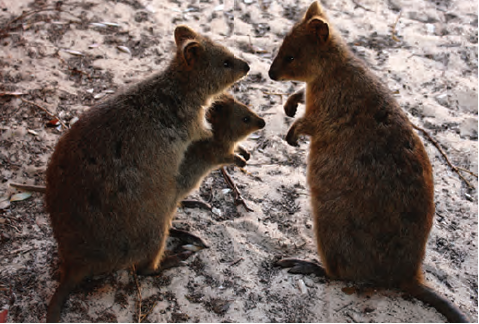
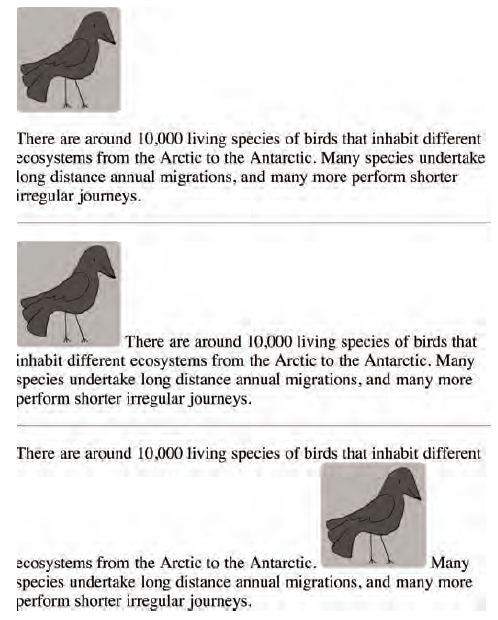
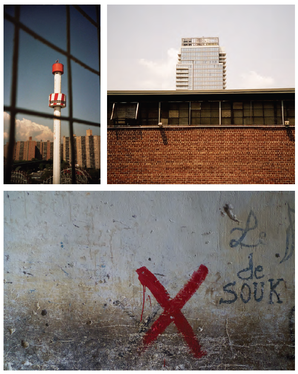
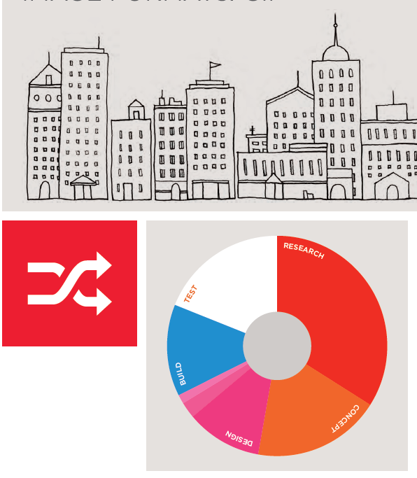
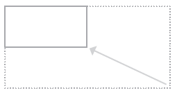
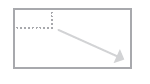
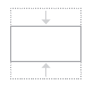
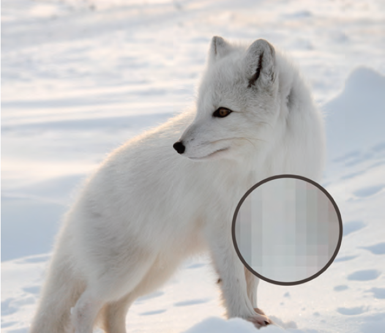
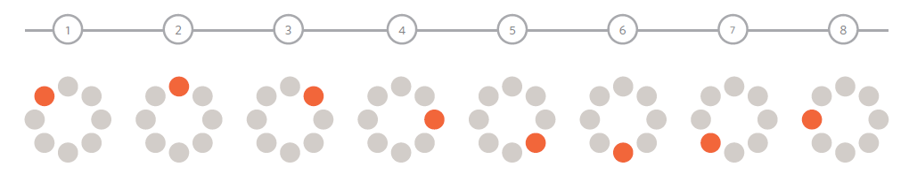
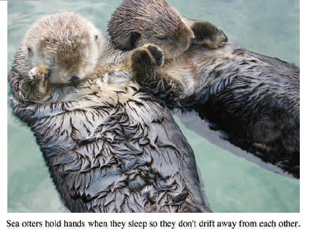

# Images

There are many reasons why you might want to add an image to a web page: you might want to include a log, photograph, illustration, diagram or chart. Several things need to be considered when selecting and preparing images for you website. Taking the time to get them right will make it look more attractive and professional

In this chapter we will learn how to:

* Including an image in your web pages using HTML
* Pick which image format to use
* Show an image at the right size
* Optimize an image for use on the web mak pages load faster

 If you are building a site from scratch, it is a good practice to create a folder for all of the images the site uses.

* Create a folder called `images` or `img` in your `root` folder
* You might add some subfolders e.g.:
  * `interface`: logo’s, buttons, backgrounds
  * `products`: photographs of products
  * …

## Adding images

To add an image into the page you need to use the `` element. This is an empty element or void element (no closing tag). It must carry at least the `src` and `alt` attributes

Attributes

* `src`: tells the browser where it can find the image. This is usually a relative URL
* `alt`: this provides an alternative text description if you cannot see it
* `title`: you can use this attribute to provide additional information about the image. Most browsers will display the content of this attribute as a tooltip when hovering over the image

```html

```



## Height and width of images

Often two additional attributes are used when displaying images

* `height`: specifies the height of the image in pixels
* `width`: specifies the width of the image in pixels

It is a good idea to specify the height and width of an image. The browser can reserve the correct space needed when rendering the page while the image is yet to be loaded

```html

```

## Where to place images in your code

Where an image is placed in the code will affect how it is displayed

1. *Before a paragraph*:
    The paragraph starts on a new line after the image
1. *Inside the start a paragraph*:
    The first row of text aligns with the bottom of the image
1. *In the middle of a paragraph*:
    The image is placed between the words of the paragraph that it appears in

```html

<p>There are around 10,000 living species of birds
  that inhabit different ecosystems from the
  Arctic to the Antarctic. Many species undertake
  long distance annual migrations, and many more
  perform shorter irregular journeys.
</p>
<hr />
<p>There are around 10,000 living
  species of birds that inhabit different
  ecosystems from the Arctic to the Antarctic. Many
  species undertake long distance annual
  migrations, and many more perform shorter
  irregular journeys.
</p>
<hr />
<p>There are around 10,000 living species of birds
  that inhabit different ecosystems from the
  Arctic to the Antarctic.Many species undertake long
  distance annual migrations, and many more perform
  shorter irregular journeys.
</p>
```



## Three rules for creating images

There are three rules to remember when creating images for your website

### 1. Save images in the right format

* Website mainly use images in jpeg, gif or png format
* Choosing the wrong format might make images load slow or unsharp

### 2. Save the images at the right size

* You should save your images in the same width and height as they will appear on the website (measured in pixels)
* Smaller might result in distorted and stretched images
* Larger might result in longer loading images and aliasing errors

### 3. Measure images in pixels

* Computer screens are made out of tiny squares known as pixels
* The resolution of the screen  may increase or decrease the pixels per cm or inch. Therefore always measure images in pixels and not in cm or inch

## Image formats

### JPEG

* When your pictures contains many different colors
* Snow or overcast sky may look like large areas that are just white or gray but the picture is usually made up of many different colors that are subtly different



### GIF or PNG

* When a picture has areas filled with exactly the same color (also know as flat colors)
  * Logos, illustrations and diagrams often use flat colors

* GIF can contain maximum 255 colors and supports animations
* PNG can contain 65535 different colors but does not support animations



## Image dimensions

Images you use on your web page should be saved at the same with and height that want them to appear on the page

* E.g.: if you want to use an image that is 300 pixels wide and 150 pixels high, your image should be 300 x 150 pixels. You may need image editing tools for resizing and cropping

### 1. Reducing image size

* Making the image smaller
* E.g: if the image is 600 pixels wide and 300 pixels tall, you can reduce the size by 50%
* The result is an image that is quicker to download



### 2. Increasing image size

* If your image is only 100 pixels wide and 50 pixels high you can increase the size by 300%
* This will result in a poorer quality image
* The image will look blurry or blocky



### 3. Changing the shape

* If your image is 300 pixels square you can remove parts of it
* You might lose valuable information
* Only some images can be cropped and still make sense



## Cropping images

When cropping images it is important not to lose valuable information. It is best to source images that are the correct shape if possible.

It is hard to convert a portrait image to a landscape image or visa versa


You can either crop valuable information, or add extra (empty space) but none of that will make a great image

## Image resolution

* When sizing an image for use on the screen you should always set dimensions of the image in terms of **pixels**
* Images on computers are made up out of tiny squares called **pixels**
* The resolution of the screen is the number of pixels represented on it e.g. `1024x768` pixels
* When showing a `640x480` pixel image on a `1024x768` pixel screen the image will appear smaller because the screen has more pixels



## Vector images

* Vector images differ from bitmap images and are resolution-independent
  * Vector images are mostly created with other software than bitmap images
* Until today, the current method was to create a bitmap version of the vector images if you wanted to display it on your page
* **Scalable Vector Graphics (SVG)** is a relatively new format used to display vector images directly on the web
* Vector images are created by placing points on a grid and draw lines between those points. Colors can be used to ‘fill in’ the lines
* The biggest advantage is you can increase the dimensions without affecting the quality of it.


## Animated gifs

* Animated GIFs show several frames of an image in sequence and therefore can be used to create simple animations
* Because the GIF format is not ideal for displaying photographs, animated GIFs are really only for simple illustrations



## Transparancy

Creating images that are partially transparent (see-trough) for the web involves selecting one of two formats

* GIF: Pixels are 100% transparent or 0% transparent, there is no possibility to have semi-transparent pixels
* PNG: PNG supports different gradations (255) of transparency. So gradient transparency is possible
    Not all older browsers support PNGs transparency (IE6 and older)


## Figure and figure caption

Figures often come with captions

* The `<figure>` element can contain images and their caption so the two are associated
* The `<figcaption>` element contains the caption that will be associated with the images in the same `<figure>` element

```html
<figure>
  
  <br />
  <figcaption>Sea otters hold hands when they
    sleep so they don't drift away from each
    other.</figcaption>
</figure>
```



## Summary

* The `` element is used to add images to a web page
* You must always specify a `src` attribute to indicate the source of an image and an `alt` attribute to describe the content of an image
* You should save the images at the size you will be using them on the web page and in the appropriate format
* Photographs are best saved as JPEG; illustrations or logos that use flat colors are better saved as GIFs or PNGs
