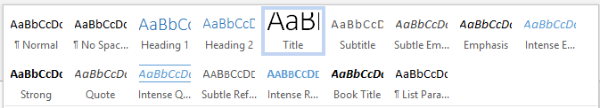
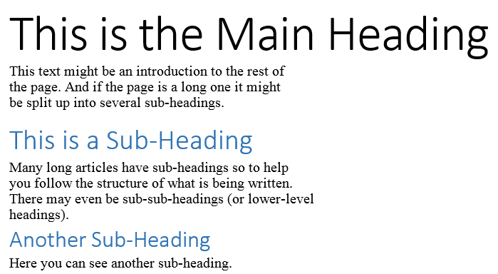
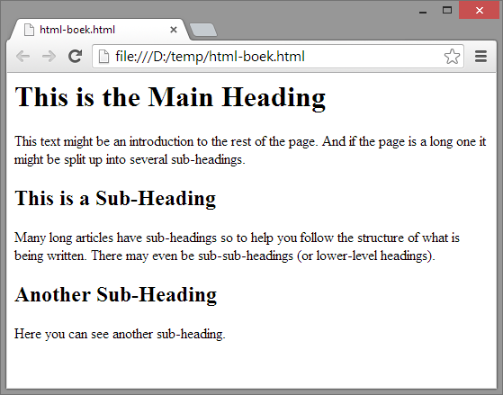
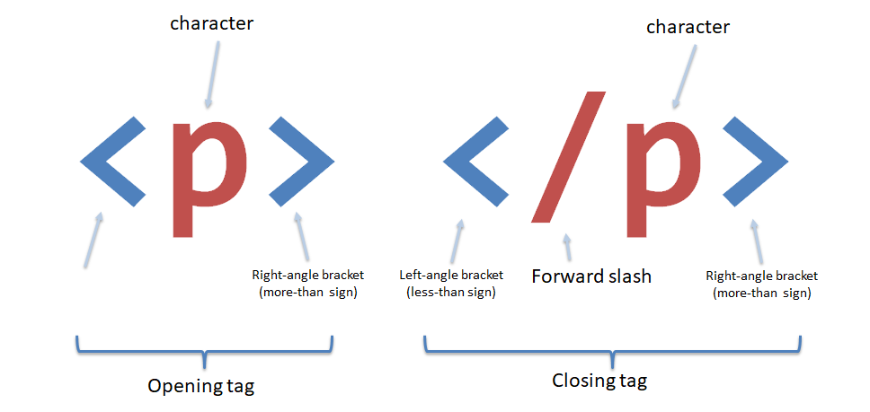
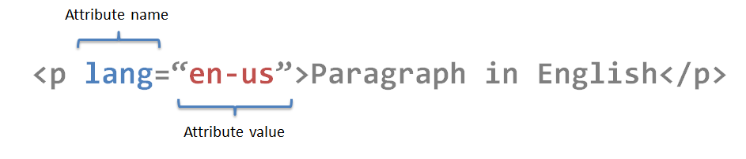

# HyperText Markup Language - HTML

## Structure

We come across all kinds of documents every day:

* Newspapers,
* Insurance forms
* Shop catalogs
* ...

Many web pages act like electronic versions of these documents. In all kinds of documents, structure is very important. Helping readers to understand the messages you try to convey. Navigating around the document

So to understand how web pages are built, it is important to understand the structure of documents.

## How pages use structure


Think about stories in the newspaper. Each story has:

* A headline
* Some text
* Possibly some images
* Sub headlines if it is a long article
* Maybe some quotes

Structure helps the reader to understand the story. The structure is very similar when the story is viewed online. Although it may also feature audio or video. Exactly the same counts for other types of documents like insurance forms, catalogs,…

### Structuring Word documents

The use of headings and subheadings. Reflecting the hierarchy of the information. For example: A document may start with a large heading. Followed by an introduction. Headings separating paragraphs.





## HTML describes the structure of pages

Here we have a HTML document that features exactly the same as our Word document.



The HTML code for this document looks as followed.

```html
<html>
    <body>
        <h1>This is the Main Heading</h1>
        <p>    This text might be an introduction to the rest of
            the page. And if the page is a long one it might
            be split up into several sub-headings.<p>
        <h2>This is a Sub-Heading</h2>
        <p> Many long articles have sub-headings so to help
            you follow the structure of what is being written.
            There may even be sub-sub-headings (or lower-level
            headings).</p>
        <h2>Another Sub-Heading</h2>
        <p>Here you can see another sub-heading.</p>
    </body>
</html>
```

HTML code is made up of characters that live inside angled brackets `<` and `>`. These are called HTML **elements**. Elements are usually made up of two **tags**: an opening tag and a closing tag \(the closing tag had an extra forward slash `/` \). Each HTML element tells the browser something about the information that sits between the opening and closing tag.

```html
<h1>This is the main title</h1>
```

```html
<html> … </html>
```

saying that anything between these tags is HTML code

```html
<body> … </body>
```

the body is what the browser will display

```html
<h1> … </h1>
```

words between these tags are the main heading

```html
<p> … </p>
```

A paragraph of text appears between these tags

```html
<h2> … </h2>
```

this denotates a sub-heading

```html
<p> … </p>
```

Another paragraph …

## A closer look at HTML tags



The character(s) that are used in the closing and opening tag are called the **element name**.

Everything that is placed between the open an closing tag gets the _meaning_ that is expressed by the _element_.

## Attributes tell us more about elements



Attributes provide **additional information** about the content of an element. They appear on the opening tag of the element. Made out of two parts:

* Name
* Value

In the example above, the _attribute_ is called `lang` and has a _value_ of `en-us`. This means that the text contained in the `p` element is expressed in the English language, used in the US (`en-us`).

## HTML element

All HTML elements should be placed inside an HTML element

```html
<html>
  <!-- other element live here -->
</html>
```

The start en end tag, define where the HTML document starts and where it ends.

## Body, Head and Title

`<body>` Everyting inside this element is shown in the main browser window.

`<head>` Before the body element you will see an head element Contains information about the page that is shown The title element is defined here.

`<title>` The contents of the title element is shown in the top of the browser, or in the tab of that page.

## Summary

* HTML pages are text documents
* HTML uses tags \(characters that sit inside angled brackets\) to give the information they surround special meaning
* Tags are often referred to as elements
* Tags usually come in pairs. The opening tag denotes the start of the piece of content; The closing tag denotes the end
* Opening tags can carry attributes, which tell us more about the content of that element
* Attributes require a name and a value
* To learn HTML you need to know what tags are available for you to use, what they do, and where they go
