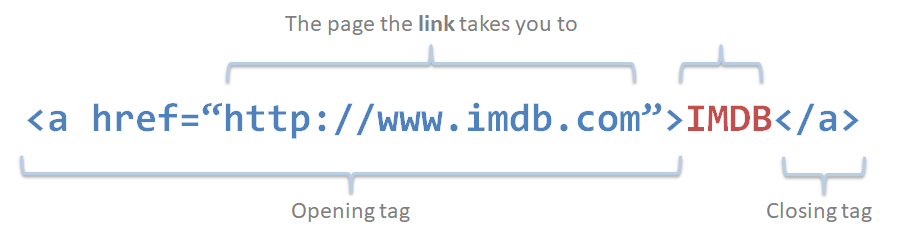
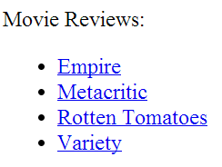
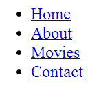
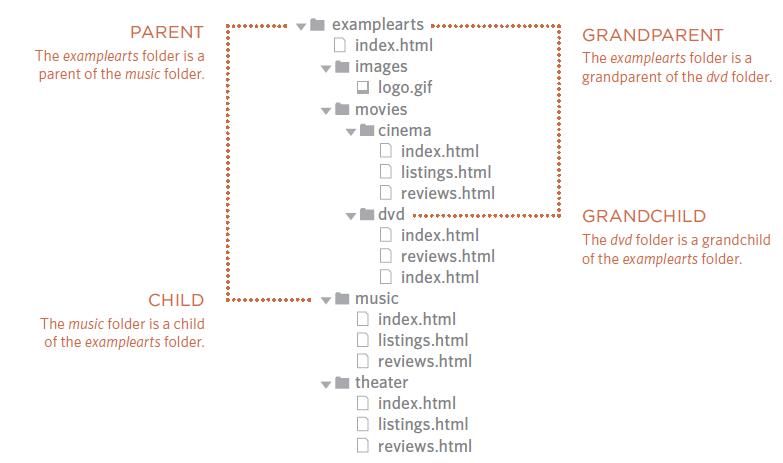
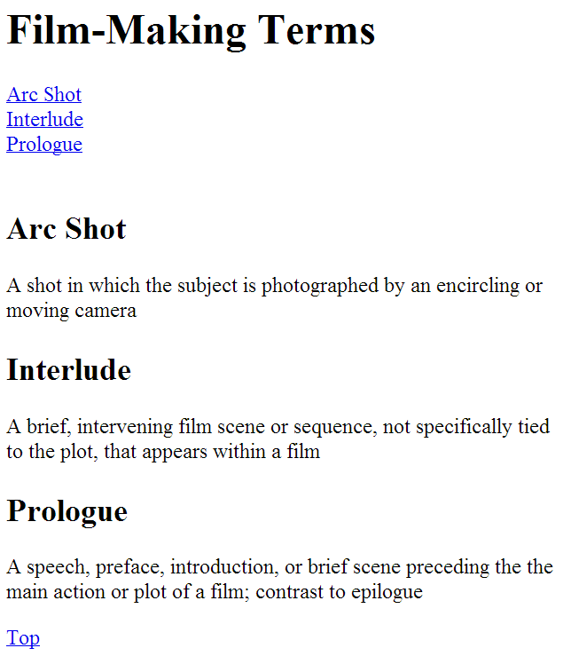

# Links

* Links are the defining feature of the web because they allow you to move from one web page to another – enabling the very idea of browsing or surfing
* Types of links
  * Links from one webpage to another
  * Links form one page to another on the same website
  * Links from one part of a webpage to another part of the same page
  * Links that open in a new browser window
  * Links that start up your email program and address a new email to someone

## Writing links

* Links are created with the `<a>` element
* The user can click on anything inside an `<a>` element
* You can specify which page you want to link to using the `href` attribute
* The browser will show links in another color (blue) and underlined to distinguish from normal text



[IMDB](http://www.imdb.com)

## Links to another site

* When linking to a different website, the value of the `href` attribute will be the full web address for the site, this is known as the **absolute URL**
* Absolute URLs start with the domain name of that site and can be followed by the path to a specific page
  * If no page is specified, the site will display the homepage

```html
<p>Movie Reviews:
    <ul>
        <li><a href="http://www.empireonline.com">
            Empire</a></li>
        <li><a href="http://www.metacritic.com">
            Metacritic</a></li>
        <li><a href="http://www.rottentomatoes.com">
            Rotten Tomatoes</a></li>
        <li><a href="http://www.variety.com">
            Variety</a></li>
    </ul>
</p>
```



## Link to other pages on the same site

* When linking to other pages on the same site, you do not need to specify the domain name in the URL. You an use a shorthand know as **relative URL**
* If all pages of the site are in the same folder, you can just specify the name of the file as the value of the `href` attribute

```html
<p>
    <ul>
        <li><a href="index.html">Home</a></li>
        <li><a href="about-us.html">About</a></li>
        <li><a href="movies.html">Movies</a></li>
        <li><a href="contact.html">Contact</a></li>
    </ul>
</p>
```



## Directory structure

* On larger sites it is a good idea to organize your code by placing the pages for each different section of the site into a new folder.
  * Folders on a website are sometimes referred to as directories



Structure

* The top-level folder is known as the `root` folder
  * The root folder contains all other files and folders of the website
* Each section of the website is placed in a separate folder; this helps organizing the files

Relationships

The relationships between files and folders are described using the same terminology as a family tree

* The exampleart folder is a parent of the movies, music and theater folders
* The movies, music and theater folder are children of the exampleart folder
* Movies, music and theater are siblings of each other
* The folder dvd is a grandchild of exampleart
* The folder exampleart is a grandparent of dvd

The main page of a site written in HTML (and the homepage of each section  in a child folder) is called `index.html`. Webservers are usually set up to return the `index.html` page if no file name is specified.

`Examplearts.com` will return `examplearts.com/index.html` and `examplearts.com/music` will return `examplearts.com/music/index.html`

## Relative URLs

Relative URLs can be used when linking to pages within your own website

They provide a shorthand way of telling the browser where to find your files

Same folder

* Just use the filename
* E.g.: `<a href="reviews.html">Reviews</a>` To link from music reviews from the music homepage

Child folder

* Use the name of the folder followed by a slash `/` and then the file name
* E.g.: `<a href="music/listings.html">Listings</a>` To link to music listings from the homepage

Grandchild folder

* Use the name of the child folders followed by a slash `/` and then the file name
* E.g.: `<a href="movies/dvd/review.html">Reviews</a>` To link to DVD reviews from the homepage

Parent folder

* Use `../` to indicate the folder above the current one, then follow with the file name
* E.g.: `<a href="../index.html">Home</a>` To link to the homepage from the music reviews

Grandparent folder

* Repeat the `../` to indicate the folders above the current one and then follow with the file name
* E.g.: `<a href="../../index.html">Home</a>` To link to the homepage from the DVD reviews

## Email links

* To create a link that starts up the users email program and addresses an email to a specified email address you can just use the `<a>` element
* The value of the `href` attribute should consist start with `mailto:` and is followed by the email address

```html
<a href="mailto:jon@example.org">Email Jon</a>
```

## Opening links in a new window or tab

* Use the `target` attribute to open a link in a new window or tab in the opening tag of an `<a>` element
* This is mostly used if your link points to another website and you hope the user will return to your website after finishing looking at the other website
  * It is a good practice to inform the user that the link will be opened in a new window

```html
<a href="http://www.imdb.com" target="_blank">
Internet Movie Database</a> (opens in new window)
```

## Linking to a specific part of the same page

* You might want to link to another part of the same page
  * E.g. a table of contents that links to the corresponding sections
  * Or you want to link back to the top of the page
* Before you can link to a specific part you need to identify the point on the page
  * You need to add an `"id"` attribute to those targets
  * An id attribute value should start with a letter of an underscore (not a number of other character)
  * On a single page no two `id` attributes should have the same value
* To link to the element that has an `id` attribute, you just use the `<a>` element again but the `href` attribute should start with the `#` symbol followed by the value of the `id` attribute of the target

```html
<h1 id="top">Film-Making Terms</h1>
<a href="#arc_shot">Arc Shot</a><br />
<a href="#interlude">Interlude</a><br />
<a href="#prologue">Prologue</a><br /><br />
<h2 id="arc_shot">Arc Shot</h2>
<p>A shot in which the subject is photographed
    by an encircling or moving camera</p>
<h2 id="interlude">Interlude</h2>
<p>A brief, intervening film scene or sequence,
    not specifically tied to the plot, that
    appears within a film</p>
<h2 id="prologue">Prologue</h2>
<p>A speech, preface, introduction, or brief
    scene preceding the the main action or plot
    of a film; contrast to epilogue</p>
<p><a href="#top">Top</a></p>
```



## Summary

* Links are created using the `<a>` element
* The `<a>` element uses the `href` attribute to indicate the page you are linking to
* If you are linking to a page within your own site, it is best to use relative links rather than qualified URLs
* You can create links to open email programs with an email address in the "to" field
* You can use the `id` attribute to target elements within a page that can be linked to
