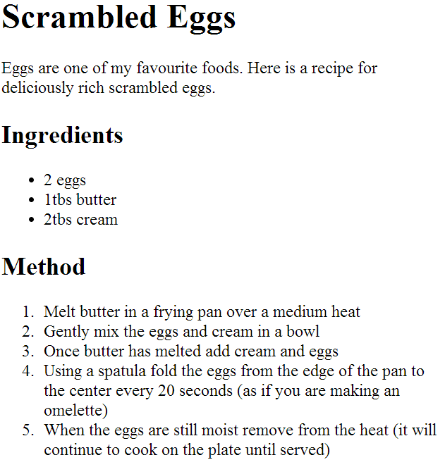
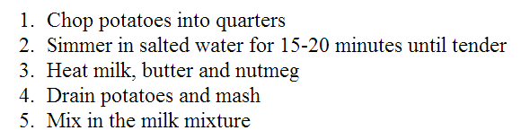
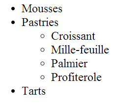

# Lists

There are lots of occasions when we need to use lists. HTML provides two different types:

* **Ordered lists** are lists where each item in the list is numbered
  * E.g. a set of steps for a recipe that must be performed in order
  * E.g. legal contract where each point needs to be identified
* **Unordered lists** are lists that begin with a bullet point



## Ordered lists

* The ordered list is created with the `<ol>` element
* Each item in the list is placed inside an `<li>` element
  * `<li>` stands for list item
* Browsers indent lists by default

```html
<ol>
  <li>Chop potatoes into quarters</li>
  <li>Simmer in salted water for 15-20
    minutes until tender</li>
  <li>Heat milk, butter and nutmeg</li>
  <li>Drain potatoes and mash</li>
  <li>Mix in the milk mixture</li>
</ol>
```



## Unordered list

* The unordered list is created with the `<ul>` element
* Just like with an ordered list, each item in the list is placed inside an `<li>` element

```html
<ul>
  <li>1kg King Edward potatoes</li>
  <li>100ml milk</li>
  <li>50g salted butter</li>
  <li>Freshly grated nutmeg</li>
  <li>Salt and pepper to taste</li>
</ul>
```


## Nested lists

* You can nest lists inside other lists
  * The nested list must be inside an <li> element
  * Ordered an unordered lists can be nested too

```html
<ul>
  <li>Mousses</li>
  <li>Pastries
    <ul>
      <li>Croissant</li>
      <li>Mille-feuille</li>
      <li>Palmier</li>
      <li>Profiterole</li>
    </ul>
  </li>
  <li>Tarts</li>
</ul>
```



## Summary

* There are three types of HTML lists:
  * Ordered
  * Unordered
  * Definition
* Ordered lists use numbers
* Unordered lists use bullets
* Definition lists are used to define terminology
* Lists can be nested inside each other
