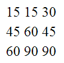
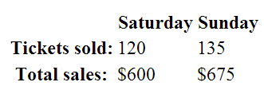
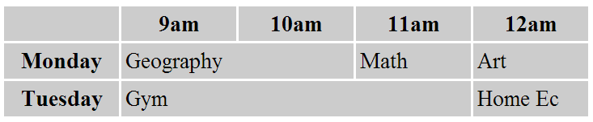
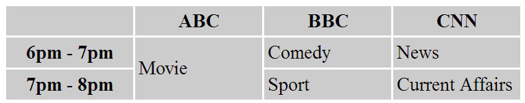
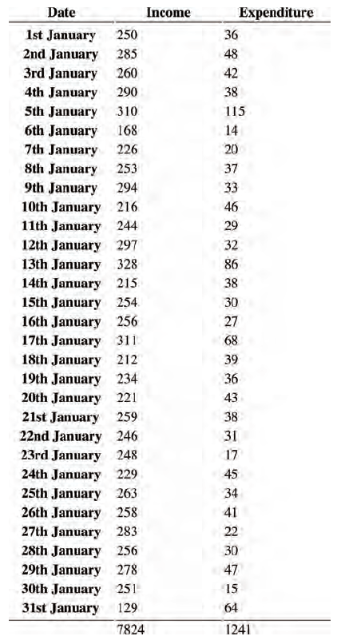

# Tables

There are several types of information that need to be displayed in a grid or table.

E.g. sports results, stock reports, train timetables,…

When representing information in a table you need to think in terms of a grid made up of rows and columns (a bit like a spreadsheet)

In this chapter we will learn how to:

* Use the four key elements for creating tables
* Representing complex data using tables
* Adding captions to tables

---


## Basic table structure

The `<table>` element is used to create a table. To indicate each row in the table the `<tr>` element is used. Each table row contains one or more table data elements `<td>`. The `<td>` element represents a cell in the table.

Note: some browsers might draw lines around the table and it cells

```html
<table>
  <tr>
    <td>15</td>
    <td>15</td>
    <td>30</td>
  </tr>
  <tr>
    <td>45</td>
    <td>60</td>
    <td>45</td>
  </tr>
  <tr>
    <td>60</td>
    <td>90</td>
    <td>90</td>
  </tr>
</table>
```

The browser could present the example as following:



## Table headings

The `<th>` element is used like the `<td>` element but its purpose is to represent the heading of either a column or a row. Even if a cell has no content you should still use a `<td>` or `<th>` element otherwise the table may render incorrectly.

You can use the `scope` attribute to indicate whether the heading applies to a row instead of the column.

```html
<table>
  <tr>
    <th></th>
    <th scope="col">Saturday</th>
    <th scope="col">Sunday</th>
  </tr>
  <tr>
    <th scope="row">Tickets sold:</th>
    <td>120</td>
    <td>135</td>
  </tr>
  <tr>
    <th scope="row">Total sales:</th>
    <td>$600</td>
    <td>$675</td>
  </tr>
</table>
```

This browser might present this as following:



## Spanning columns

The `colspan` attribute can be used on `<th>` and `<td>` elements to indicate how many columns that the cell should run across.

```html
<table>
  <tr>
    <th></th>
    <th>9am</th>
    <th>10am</th>
    <th>11am</th>
    <th>12am</th>
  </tr>
  <tr>
    <th>Monday</th>
    <td colspan="2">Geography</td>
    <td>Math</td>
    <td>Art</td>
  </tr>
  <tr>
    <th>Tuesday</th>
    <td colspan="3">Gym</td>
    <td>Home Ec</td>
  </tr>
</table>
```

The browser might render something like this:



## Spanning rows

The `rowspan` attribute can be used on `<th>` and `<td>` elements to indicate how many rows that the cell should span down.

```html
<table>
  <tr>
    <th></th>
    <th>ABC</th>
    <th>BBC</th>
    <th>CNN</th>
  </tr>
  <tr>
    <th>6pm - 7pm</th>
    <td rowspan="2">Movie</td>
    <td>Comedy</td>
    <td>News</td>
  </tr>
  <tr>
    <th>7pm - 8pm</th>
    <td>Sport</td>
    <td>Current Affairs</td>
  </tr>
</table>
```

The browser might render something like this:



## Long tables

There are three elements that help distinguish between the main content of the table and the first and last rows:

* `<thead>` element should contains the table headings
* `<tbody>` element contains the actual table body
* `<tfoot>` elements containing the footer row for the table

```html
<table>
  <thead>
      <tr>
      <th>Date</th>
      <th>Income</th>
      <th>Expenditure</th>
    </tr>
  </thead>
  <tbody>
    <tr>
      <th>1st January</th>
      <td>250</td>
      <td>36</td>
    </tr>
    <!-- additional rows as above -->
    <tr>
      <th>31st January</th>
      <td>129</td>
      <td>64</td>
    </tr>
  </tbody>
  <tfoot>
    <tr>
      <td></td>
      <td>7824</td>
      <td>1241</td>
    </tr>
  </tfoot>
</table>
```

The example above might be rendered like this:



## Summary

* The `<table>` element is used to add tables to a web page
* A table is drawn out row-by-row. Each row is created with the `<tr>` element
* Inside each row there are a number of cells represented by the `<td>` element (or `<th>` if it is a header)
* You can make cells of a table span more than one row or column using the `rowspan` and `colspan` attributes
* For long tables you can split the table into a `<thead>`, `<tbody>` and `<tfoot>`
