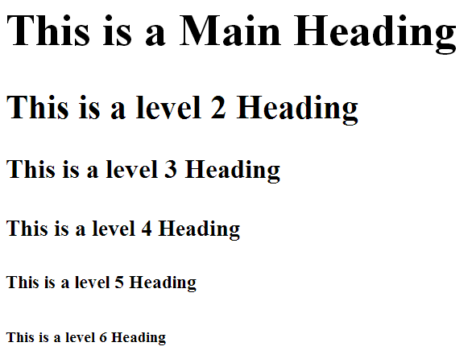
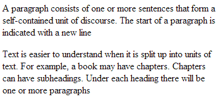
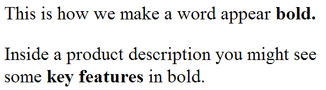
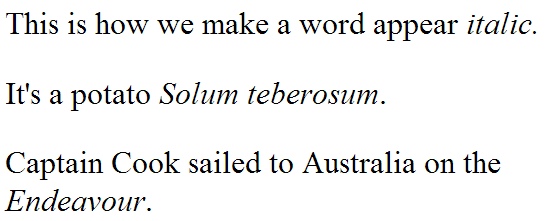
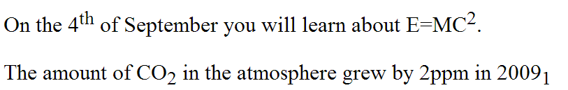
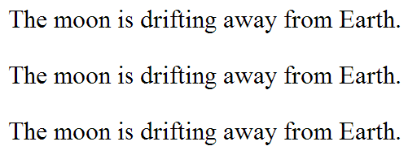
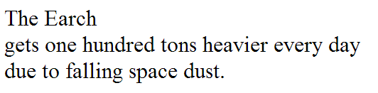
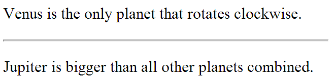

# Text

When creating a webpage you add tags (also known as markup) to the content of a page. These tags provide extra meaning. They allow the browser to show the user the appropriate structure.

## Headings

HTML knows about 6 "levels" of headings

* `<h1>` is the larges element
* `<h6>` is the smallest element

`<h1>` is used for the main heading, `<h2>` and so on are used for subheadings

```html
<h1>This is a Main Heading</h1>
<h2>This is a level 2 Heading</h2>
<h3>This is a level 3 Heading</h3>
<h4>This is a level 4 Heading</h4>
<h5>This is a level 5 Heading</h5>
<h6>This is a level 6 Heading</h6>
```



## Paragraphs

To create paragraphs, surround the words that make up the paragraph with an opening tag <p> and closing tag </p>
By default, a browser will show each paragraph on a new line with some space between it and any subsequent paragraphs

```html
<p>
    A paragraph consists of one or more  
    sentences that form a self-contained unit
    of discourse. The start of a paragraph is
    indicated with a new line.
</p>
<p>
    Text is easier to understand when it is
    split up into units of text. For example,
    a book may have chapters. Chapters can
    have subheadings. Under each heading
    there will be one or more paragraphs.
</p>
```



## Bold

* We can make characters appear bold with a `<b>` element.
* Only presented in a visually different way
* Does not imply any additional meaning.
  * Also see the `<strong>` element

```html
<p>
    This is how we make a word appear <b>bold.</b>
</p>
<p>
    Inside a product description you might see some
   <b>key features</b>in bold.
</p>
```



## Italic

* We can make characters appear italic with a <i> element
* Only presented in a visually different way
* Does not imply any additional meaning.
  * Also see the <em> element

```html
<p>
    This is how we make a word appear <i>italic</i>.
</p>
<p>
    It's a potato <i>Solum teberosum</i>.
</p>
<p>
    Captain Cook sailed to Australia on the <i>Endeavour</i>.
</p>
```



## Superscript and subscript

* Use a `<sup>` element if characters should be in superscript such suffixes of dates or mathematical concepts like raising a number to a power
* Use a `<sub>` element if characters should be in subscript such as commonly used in foot notes or chemical formulas

```html
<p>
    On the 4<sup>th</sup> of September you will learn
    about E=MC<sup>2</sup>.
</p>
<p>
    The amount of CO<sub>2</sub> in the atmosphere
   grew by 2ppm in 2009<sub>1</sub>
</p>
```



## White space

* The browser will ignore two or more spaces next to each other
* The browser will also ignore line breaks (new lines)
* This is called white **space collapsing**

```html
<p>The moon is drifting away from Earth.</p>
<p>The moon         is drifting away from Earth.</p>
<p>The moon is drifting away from

        Earth.</p>
```



## Line breaks

* If the browser will ignore and remove all newlines, how can I add a line break inside the middle of a paragraph?
* U can use the break element `<br>`

* This is an element with no content between an opening and a closing tag
* The `<br>` element has no closing tag. This is called an **empty element** or **void elements**

```html
<p>
    The Earch<br />gets one hundred tons heavier
    every day<br />due to falling space dust.
</p>
```



## Horizontal rules

* To create a break between themes, you can add a horizontal rule between sections
* You can use the `<hr />` element
  * This is also an empty element

```html
<p>
    Venus is the only planet that rotates clockwise.
</p>
<hr />
<p>
    Jupiter is bigger than all other planets combined.
</p>
```


