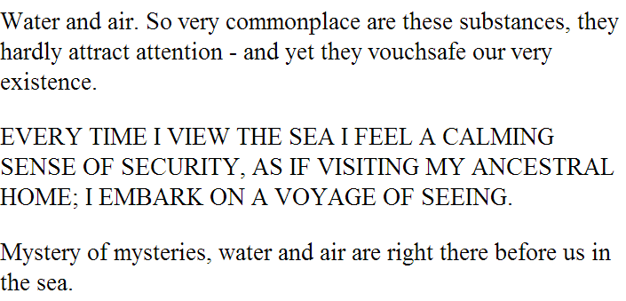
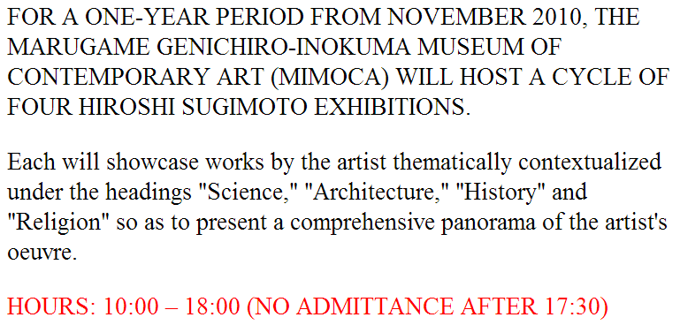
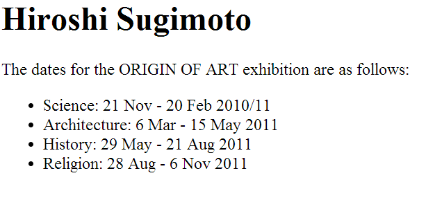
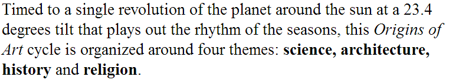
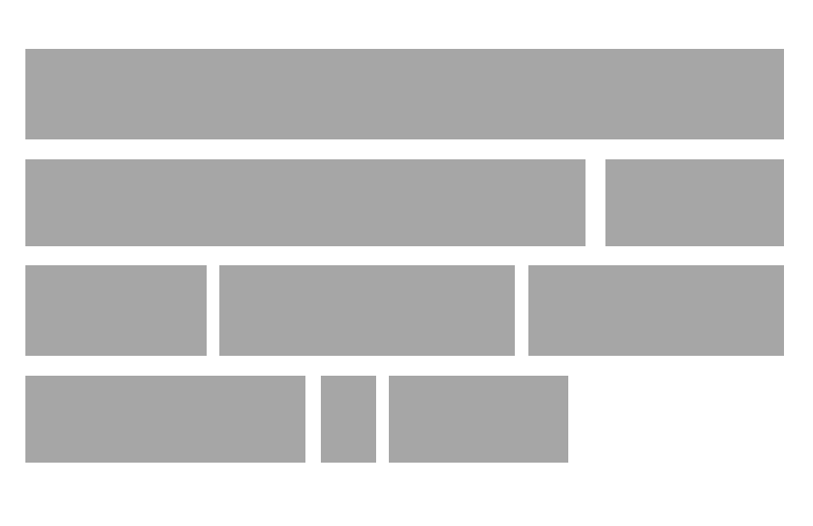
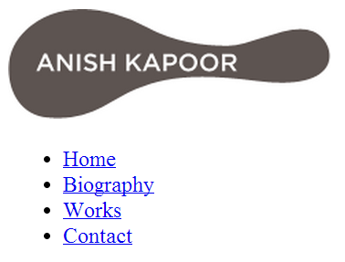
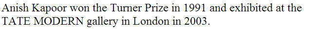
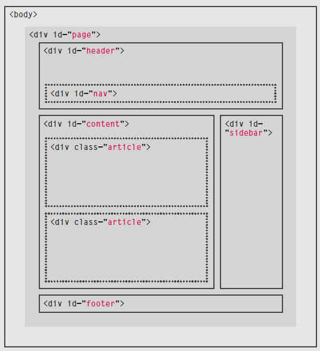
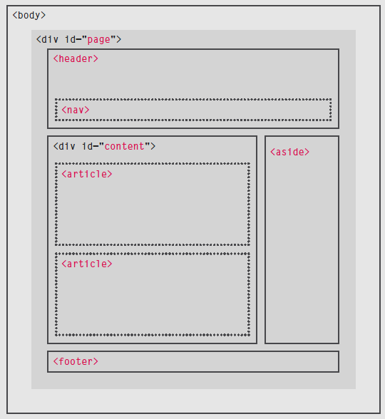

# HTML Layout elements

## Global attributes

Global attributes can be used and set on any HTML element, regardless of its type.

### `id` attribute

Every element can carry the `id` attribute, it is known as an **global attribute**

It is used to uniquely identify that element from other elements

The value can start with a letter or an underscore, but not with a number or any other character

No two element can contain the same `id` attribute value

The `id` attribute is often applied with CSS and JavaScript. It is mostly used to target specific instances of html elements

By default, using the `id` attribute does not affect the presentation

* CSS uses the `id` attribute to target style to the specific element instead of all elements of that type

```html
<p>Water and air. So very commonplace are these
    substances, they hardly attract attention - and
    yet they vouchsafe our very existence.</p>
<p id="pullquote">Every time I view the sea I feel
    a calming sense of security, as if visiting my
    ancestral home; I embark on a voyage of seeing.
</p>
<p>Mystery of mysteries, water and air are right
    there before us in the sea.</p>
```



### `class` attribute

* Every HTML element can carry an `class` attribute
* Rather than uniquely identifying one single element \(like the `id` attribute\) it can identify several elements as being different from the other elements
  * E.g: some paragraphs might contain more important information than others and we want to distinguish these elements
* The value of the `class` attributes should describe the ‘class’ it belongs to
* The `class` attribute of any element can share the same value, even if they are not of the same type
* The `id` attribute is often applied with CSS and JavaScript
  * It is mostly used to target specific instances of html elements

By default, using the `class` attribute does not affect the presentation

```html
<p class="important">For a one-year period from
    November 2010, the Marugame Genichiro-Inokuma
    Museum of Contemporary Art (MIMOCA) will host a
    cycle of four Hiroshi Sugimoto exhibitions.</p>
<p>Each will showcase works by the artist
    thematically contextualized under the headings
    "Science," "Architecture," "History" and
    "Religion" so as to present a comprehensive
    panorama of the artist's oeuvre.</p>
<p class="important admittance">Hours: 10:00 – 18:00
    (No admittance after 17:30)</p>
```



## Block elements

Some elements will always appear to the start of a new line in the browser window  
These elements are known as **block level** elements

E.g: `<h1>`, `<p>`, `<ul>`, `<li>`

```html
<h1>Hiroshi Sugimoto</h1>
<p>The dates for the ORIGIN OF ART exhibition are as
    follows:</p>
<ul>
    <li>Science: 21 Nov - 20 Feb 2010/11</li>
    <li>Architecture: 6 Mar - 15 May 2011</li>
    <li>History: 29 May - 21 Aug 2011</li>
    <li>Religion: 28 Aug - 6 Nov 2011</li>
</ul>
```



When visualizing the boxes for these elements we get something like this.


## Inline elements

Some elements will always appear to continue on the same line as their neighboring elements, these elements are known as **inline** elements

E.g: `<a>`, `<b>`, `<em>`, ``

```html
Timed to a single revolution of the planet around
the sun at a 23.4 degrees tilt that plays out the
rhythm of the seasons, this <em>Origins of Art</em>
cycle is organized around four themes: <b>science,
architecture, history</b> and <b>religion</b>.
```





## Grouping Text and elements in a block

### `<div>` element

The `<div>` element allows you to **group** a set of elements together in one **block-level box**

It will make no difference tot the presentation of the page

* Using the `id` or `class` attribute however it can be used to style the group
* `<div>`’s also can make it easier to follow your code

```html
<div id="header">
    
    <ul>
        <li><a href="index.html">Home</a></li>
        <li><a href="biography.html">Biography</a></li>
        <li><a href="works.html">Works</a></li>
        <li><a href="contact.html">Contact</a></li>
    </ul>
</div><!-- end of header -->
```



## `<span>` elements

The `<span>` element acts like the inline equivalent of the `<div>` element.

It can be used for:

1. Contain a section of text where there is no other suitable to differentiate it from its surrounding text
1. Contain a number of inline elements

Mostly used to control the appearance of the element using CSS

```html
<p>Anish Kapoor won the Turner Prize in 1991 and
    exhibited at the <span class="gallery">Tate
    Modern</span> gallery in London in 2003.</p>
```



## HTML 5 layout elements

HTML 5 introduces a new set of elements that help define the structure of a page
In this chapter you will see:

* The new HTLM5 layout elements and their uses
* How they offer helpful alternatives to the `<div>` element
* How to ensure older browsers recognize these elements

## Traditional HTML layouts

For a long time, the `<div>` element is used to group together related elements on a page (such as headers, articles, footers or sidebars)
Authors used class and id attributes to indicate the role of the `<div>` element in the structure of the page



## Layout elements

HTML5 introduces a new set of elements that allow you to divide up the parts of a page. The names of these elements indicate the kind of content you will find in them

* `<header>`
* `<nav>`
* `<aside>`
* `<footer>`
* `<article>`
* …



### Headers and footers

The `<header>` and `<footer>` elements can be used for:

* The main header and footer that appears on the top or bottom of every page on the site
* A header or footer for an individual `<article>` or `<section>` within the page

```html
<header>
  <h1>Yoko's Kitchen</h1>
  <nav>
    <ul>
      <li><a href="" class="current">home</a></li>
      <li><a href="">classes</a></li>
      <li><a href="">catering</a></li>
      <li><a href="">about</a></li>
      <li><a href="">contact</a></li>
    </ul>
  </nav>
</header>
```

```html
<footer>
  &copy; 2011 Yoko's Kitchen
</footer>
```

### Navigation

The `<nav>` element is used to contain the major navigational blocks on the site such as primary site navigation

```html
<nav>
  <ul>
    <li><a href="" class="current">home</a></li>
    <li><a href="">classes</a></li>
    <li><a href="">catering</a></li>
    <li><a href="">about</a></li>
    <li><a href="">contact</a></li>
  </ul>
</nav>
```

### Articles

The `<article>` element acts as a container for any section of a page that could stand alone and potentially syndicated (RSS feeds). E.g: individual blog entries, a comment or forum post or any other independent piece of content

Pages can contain several articles, each would live inside its own `<article>` element. It even can be nested inside other `<article>` elements

```html
<article>
  <figure>
    
    <figcaption>Bok Choi</figcaption>
  </figure>
    <h2>Japanese Vegetarian</h2>
  <p>A five week introduction to traditional
    Japanese vegetarian meals, teaching you a
    selection of rice and noodle dishes.</p>
</article>
<article>
  <figure>
    
    <figcaption>Teriyaki Sauce</figcaption>
  </figure>
  <h2>Sauces Masterclass</h2>
  <p>An intensive one-day course looking at how to
    create the most delicious sauces for use in a
    range of Japanese cookery.</p>
</article>
```

### Asides

The `<aside>` element has two purposes, depending on whether its inside an `<article>` element or not

* When the `<aside>` element is used inside an `<article>` element, it should contain information that is related to the article but is not essential to its overall meaning
* When the `<aside>` element is used outside an `<article>` it acts as a container for content that is related to the entire page. E.g: links to other sections of the site, a list of recent posts, a search box…

```html
<aside>
  <section class="popular-recipes">
    <h2>Popular Recipes</h2>
    <a href="">Yakitori (grilled chicken)</a>
    <a href="">Tsukune (minced chicken patties)</a>
    <a href="">Okonomiyaki (savory pancakes)</a>
    <a href="">Mizutaki (chicken stew)</a>
  </section>
  <section class="contact-details">
    <h2>Contact</h2>
    <p>Yoko's Kitchen<br />
      27 Redchurch Street<br />
      Shoreditch<br />
      London E2 7DP</p>
  </section>
</aside>
```

### Section

The `<section>` element is groups related content together and typically each section would have it’s own heading. E.g: a site with different sections such as latest news, top products and newsletter signup. It should not be used to wrap the entire page

```html
<section class="popular-recipes">
  <h2>Popular Recipes</h2>
  <a href="">Yakitori (grilled chicken)</a>
  <a href="">Tsukune (minced chicken patties)</a>
  <a href="">Okonomiyaki (savory pancakes)</a>
  <a href="">Mizutaki (chicken stew)</a>
</section>
<section class="contact-details">
  <h2>Contact</h2>
  <p>Yoko's Kitchen<br />
    27 Redchurch Street<br />
    Shoreditch<br />
    London E2 7DP</p>
</section>
```
