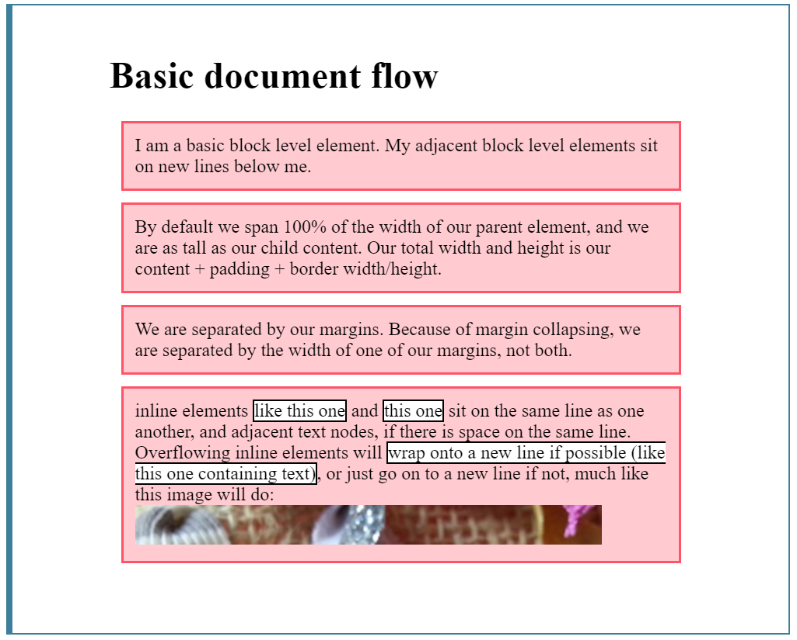

# Normal flow

As detailed in the last lesson introducing layout, elements on a webpage lay out in the normal flow, if you have not applied any CSS to change the way they behave. And, as we began to discover, you can change how elements behave either by adjusting their position in that normal flow, or removing them from it altogether. Starting with a solid, well-structured document that is readable in normal flow is the best way to begin any webpage. It ensures that your content is readable, even if the user is using a very limited browser or a device such as a screen reader that reads out the content of the page. In addition, as normal flow is designed to make a readable document, by starting in this way you are working with the document rather than fighting against it as you make changes to the layout.

Before digging deeper into different layout methods, it is worth revisiting some of the things you will have studied in previous modules with regard to normal document flow.

## How are elements laid out by default

First of all, individual element boxes are laid out by taking the elements' content, then adding any padding, border and margin around them — it's that box model thing again, which we've looked at earlier.

By default, a block level element's content is 100% of the width of its parent element, and as tall as its content. Inline elements are all tall as their content, and as wide as their content. You can't set width or height on inline elements — they just sit inside the content of block level elements. If you want to control the size of an inline element in this manner, you need to set it to behave like a block level element with `display: block;` (or even,`display: inline-block;` which mixes characteristics from both.)

That explains individual elements, but what about how elements interact with one another? The normal layout flow (mentioned in the layout introduction article) is the system by which elements are placed inside the browser's viewport. By default, block-level elements are laid out in the direction that blocks display in the writing mode of the document — each one will appear on a new line below the last one, and they will be separated by any margin that is set on them. In English therefore, or any other horizontal, top to bottom writing mode, block-level elements are laid out vertically.

Inline elements behave differently — they don't appear on new lines; instead, they sit on the same line as one another and any adjacent (or wrapped) text content, as long as there is space for them to do so inside the width of the parent block level element. If there isn't space, then the overflowing text or elements will move down to a new line.

If two adjacent elements both have the margin set on them and the two margins touch, the larger of the two remains, and the smaller one disappears — this is called margin collapsing, and we have met this before too.

Let's look at a simple example that explains all of this:

```html
<h1>Basic document flow</h1>

<p>
  I am a basic block level element. My adjacent block
  level elements sit on new lines below me.
</p>
<p>
  By default we span 100% of the width of our parent element,
  and we are as tall as our child content. Our total width
  and height is our content + padding + border width/height.
</p>
<p>
  We are separated by our margins. Because of margin
  collapsing, we are separated by the width of one
  of our margins, not both.
</p>
...
```

```css
body {
  width: 500px;
  margin: 0 auto;
}

p {
  background: rgba(255,84,104,0.3);
  border: 2px solid rgb(255,84,104);
  padding: 10px;
  margin: 10px;
}

span {
  background: white;
  border: 1px solid black;
}
```


