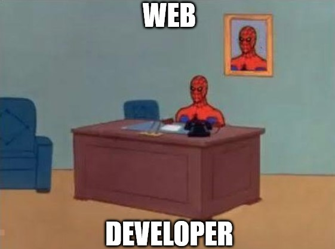

---

---

# Web Essentials

Welcome to the Web Essentials course. This course will give you an introduction in how the internet and the web works. It will teach you the core principles and technologies that drive the internet as we know it.
The course is divided into 3 main chapters.

* **How the web works**: An introduction into the why's an how's of the internet and web. It will introduce the underlying principles, protocols and technologies that make the web and internet work.
* **Building webpages**: The main part of the course that will teach on how to build webpages using HTML, CSS and JavaScript. Most of the challenges and exercises will focus on the content discussed in these chapters.
* **Protocols and technologies**: Here we take a deeper dive in some protocols and technologies that where briefly touched on in the _How the web works_ chapter.

## Lifelong learning

The technology domain in general is an ever changing and evolving domain. What you knew yesterday might not apply anymore, what you know today might not applicable tomorrow. Technology improves all the time. It is impossible to create a single course that covers it all. This course functions only as a **step** to more and other information. This course will provide a solid base to get some understanding in how everything works. Your goals or challenges will quickly surpass what we are able to bring you. Therefore it is important that you learn to gather the information you need for yourself. During the course many pointers to extra sources of learning or information will be provided. Add these sources to your toolbox in order to be successful in the future.

::: quote
Any fool can know. The point is to understand.

::: right
–Albert Einstein
:::

I encourage anyone to play, tinker, hack, experiment, try out new things... This is the easiest way to learn and understand things.

## Contributions

This course is provided on GitHub as an open source project: [github.com/sillevl/course-web-essentials](https://github.com/sillevl/course-web-essentials).

If you want to improve this course simply by correcting _spelling errors_, _improve_ or _add content_, feel free to [contribute](https://github.com/sillevl/course-web-essentials#contributing) by creating [pull requests](https://github.com/sillevl/course-web-essentials/pulls).

If you are not able to make the changes for yourself, feel free to [create an issue](https://github.com/sillevl/course-web-essentials/issues)

## Chapters

1) How the web works
   1) History
   2) TCP/IP stack
   3) Client/Server model
   4) Web protocols
   5) Internet-of-Things
2) Building webpages
   1) HTML
      1) Text
      2) Lists
      3) Images
      4) Links
   2) CSS
      1) Text
      2) Colors
      3) Box model
      4) Variables
   3) Layouts
      1) Div and span elements
      2) global attributes
      3) CSS Flexbox
      4) CSS Grid
      5) Media queries (Responsive designs)
   4) JavaScript
      1) Programming Language
      2) Objects
      3) Document Object Model
      4) Events
      5) Fetch API
      6) Forms
3) Protocols and technologies
   1) URL's
   2) HTTP Protocol
      1) Headers
      2) Requests
      3) Responses
      4) Status codes
      5) Methods
      6) REST
      7) HTTP Servers
      8) Authentication
      9) Secure HTTP
   3) MQTT
   4) DNS
   5) JSON
   6) Netlify

## Exercises

No exercises defined at this time.

## Assignments

No Assignments defined at this time.

## Organisation

This course will be organized in multiple different ways:

* **On campus sessions**: Mostly theory is given. These sessions are scheduled in the class schedule and take place at the campus.
* **Online sessions**: Mostly theory is given. These sessions are scheduled in the class schedule and can be followed at home online.
* **Independent learning**: Theory that must be processed individually at your own pace. Mostly with a deadline.
* **On campus exercising sessions**: Sessions that are scheduled in the class schedule that will focus on the practical side of the course. Many exercises and challenges will be given to process at your own pace or with a deadline. This is the perfect moment to ask questions and get feedback.
* **Independent exercising**: Time to continue the challenges and exercises that are provided during the on campus exercising sessions.

## Course Evaluation

For this course you are evaluated in 2 different ways:

* 50% **Written exam**: Examination in the dedicated examination period in January.
* 50% **Permanent evaluation**: Process and exercise evaluation during the semester. Important: For this part, only 1/3th of the scores can be retaken!

For more information and the official details, please read the courses ECTS document.
